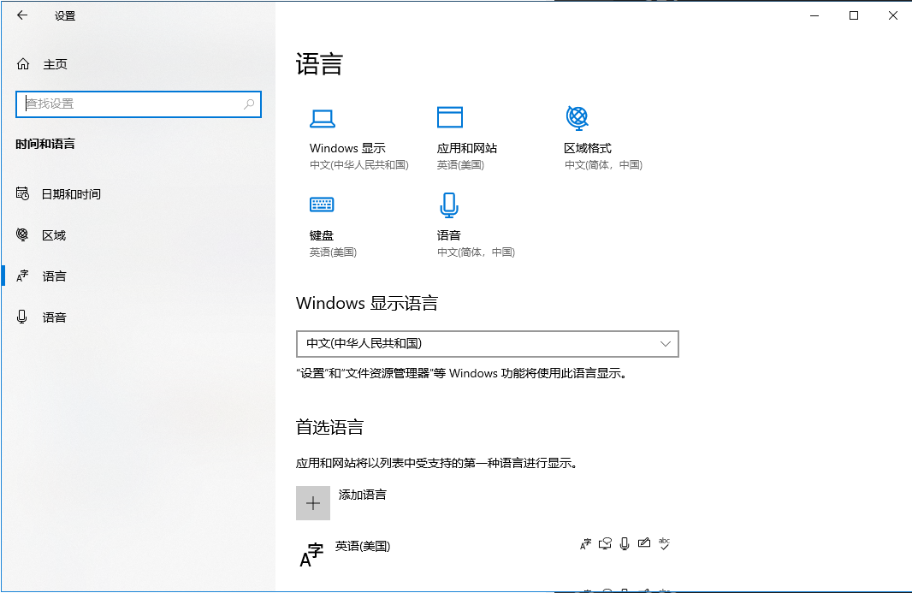

# 微软 Speech API 介绍

## 1. COM使用规范

### 1.1 使用COM原生操作

因为我们使用的接口都为COM接口，所以要符合COM的使用规范，对于COM接口，我们不需要知道太多，只需要明白以下几点：
* 在使用COM接口前和使用COM接口完毕后都要初始化COM库或者卸载COM库。
* 每个COM接口都是一个纯虚类，我们不能直接建立该接口的对象，而需要用`CoCreateInstance`函数来创建一个指向该接口派生类的对象的指针，从而可以使用该接口的各种函数和基类。
* CoCreateInstance函数的函数原型为
  ```c++
  HRESULT __stdcall CoCreateInstance(const IID &rclsid, LPUNKNOWN pUnkOuter, DWORD dwClsContext, const IID &riid, LPVOID *ppv);
  ```
  其中：
  * `rclsid`是要创建的接口实例对应接口所在的组件ID号，其中`ISpVoice`接口所在组件ID号为`CLSID_SpVoice`。
  * `pUnkOuter`是指向所创对象为聚合对象时指向的`IUnknown`接口，如果不是聚合对象，则填`NULL`。
  我们创建的不是聚合对象，所以填`NULL`。
  * `dwClsContext`决定所创对象的上下文，我们一般填`CLSCTX_ALL`就行。
  * `riid`是指要创建的接口实例对应接口的ID号。
  * `ppv`为保存指向该对象指针地址的指针，如果创建对象失败，则该指针为`NULL`。
* 每个COM接口都是用两个虚函数`AddRef`和`Release`来控制实例的生命期(`AddRef`增加1引用计数，`Release`减少1引用计数；引用计数为0时释放该实例；`CoCreateInstance`函数也会增加1引用计数)，所以我们在使用COM接口实例时需要注意实例的生命期，在使用完实例时要及时释放掉。
* COM规范中的几乎所有函数都会在被调用后返回一个`HRESULT`类型(`HRESULT`类型为`long`的别名)的值，通过该值可以判断函数的执行状况，比如是否成功等，我们可以通过两种宏`SUCCEEDED`和`FAILED`来判断函数是否成功：
  如果函数执行成功(返回`S_OK`)，则`SUCCEEDED`为`1`，`FAILED`为`0`；失败(返回`E_FAIL`)则反之。

以下是符合COM使用规范的`ISpVoice`实例创建与销毁：
```c++
#include <sapi.h>
#include <stdio.h>

// 输出执行记录
void trace(const char* strs) { printf("%s\n", strs); }

int main()
{
    // 初始化COM库
    if (FAILED(::CoInitialize(NULL)))
    {
        trace("TTS:\tInitiate failed!\n");
        return -1;
    }
    // 指向ISpVoice实例的指针piSpv
    ISpVoice* piSpv;
    // 创建该接口派生类的对象，piSpv指向该对象
    HRESULT hr = CoCreateInstance(CLSID_SpVoice, NULL, CLSCTX_ALL, IID_ISpVoice, (void**)&piSpv);
    // 判断对象是否成功创建
    if (FAILED(hr))
    {
        trace("TTS:\tcreate ISpVoice instance failed!\n");
        return -1;
    }
    /* 
        
      其他操作

    */
    // 释放实例
    piSpv->Release();
    // 卸载COM库
    ::CoUninitialize();
    return 0;
}
```

### 1.2 使用CComPtr智能指针类操作

但是用这种原始的方法创建接口对象似乎有些繁琐，所以COM标准提供了一组辅助模板类来帮助我们快速创建接口对象，那也就是之前所说的`CComPtr`智能指针类，该智能指针类在头文件`sphelper.h`中。

我们只需要在模板实参中填上所需要创建对象的接口，然后创建了一个对应接口的智能指针，我们可以将该智能指针和普通指针一样用于赋值或当实参传递等，而无需自己管理该智能指针的生命期(但是智能指针被地址运算符使用时，该智能指针必须要为`NULL`，否则该智能指针被写入新地址后，之前指向的对象不会被自动释放)。

该智能指针还有一些特别的成员函数，可以供我们使用，比如成员函数`CoCreateInstance`：
该成员和普通的全局`CoCreateInstance`函数类似，只不过不用提供接口的ID号，只需要提供接口所在的组件ID号，而且`pUnkOuter`和`dwClsContext`都有默认实参，`pUnkOuter`为`NULL`，`dwClsContext`为`CLSCTX_ALL`。
当我们使用该成员函数并创建成功后，对应的智能指针就指向了新创建的对象。

以下是使用`CComPtr`智能指针类的`ISpVoice`实例创建与销毁：
```c++
#include <sapi.h>
#include <stdio.h>
#include <sphelper.h>

// 输出执行记录
void trace(const char* strs) { printf("%s\n", strs); }

int main()
{
    // 初始化COM库
    if (FAILED(::CoInitialize(NULL)))
    {
        trace("TTS:\tInitiate failed!\n");
        return -1;
    }
    // 指向ISpVoice实例的智能指针cpSpv
    CComPtr<ISpVoice> cpSpv;
    // 创建该接口派生类的对象，cpSpv指向该对象
    HRESULT hr = cpSpv.CoCreateInstance(CLSID_SpVoice);
    // 判断对象是否成功创建
    if (FAILED(hr))
    {
        trace("TTS:\tcreate ISpVoice instance failed!\n");
        return -1;
    }
    /*

      其他操作

    */
    // 卸载COM库
    ::CoUninitialize();
    return 0;
}
```

## 2. ISpVoice接口的函数

接下来我会介绍一些`ISpVoice`接口特有的函数。

### 2.1 SetOutput函数

**介绍**

`ISpVoice::SetOutput`用于设置实例的输出对象，该对象可以是一个数据流、音频设备或者是一个代表音频输出设备对象的令牌。
如果实例没有用到该函数，或者`pUnkOutput`为`NULL`，则使用默认的音频设备。

**函数原型**

```c++
HRESULT SetOutput(IUnknown *pUnkOutput, BOOL fAllowFormatChanges);
```

**参数**

* `pUnkOutput`
  [in] 指向输出对象的`IUnknown`指针。指针必须指向实现了`ISpStreamFormat`（流或音频设备）的对象，或实现了`ISpObjectToken`的对象。
  如果提供的是一个令牌，则此方法将创建令牌所对应的对象并使用它。
  如果`pUnkOutput`为`NULL`，则将使用默认的音频输出设备。
* `fAllowFormatChanges`
  [in] 该标志指定是否允许更改语音的音频输出对象的格式，以匹配TTS引擎的格式或正在朗读的wav流格式。
  如果为`FALSE`，则语音将会使用SAPI格式转换器对渲染数据和输出对象之间进行格式转换；如果要使用默认音频设备并且输出的格式无关紧要，则应将其设置为`TRUE`。
  如果`pUnkOutput`是`ISpStreamFormat` 对象，则忽略`fAllowFormatChanges`设置，在这种情况下，则该实例将以指定的流格式输出音频数据。

**返回值**

* `S_OK`
* `E_INVALIDARG`
* `SPERR_UNINITIALIZED`
* `E_OUTOFMEMORY`

**示例**

以下是如何枚举在 `HKEY_LOCAL_MACHINE\SOFTWARE\Microsoft\Speech\AudioOutput` 下注册的所有可用音频输出设备的示例：

```c++
// Declare local identifiers:
HRESULT                        hr = S_OK;
CComPtr<ISpObjectToken>        cpAudioOutToken;
CComPtr<IEnumSpObjectTokens>   cpEnum;
CComPtr<ISpVoice>              cpVoice;
ULONG                          ulCount = 0;

// Create the SAPI voice.
hr = cpVoice.CoCreateInstance(CLSID_SpVoice);

if (SUCCEEDED (hr))
{
   // Enumerate the available audio output devices.
   hr = SpEnumTokens( SPCAT_AUDIOOUT, NULL, NULL, &cpEnum; );
}

if (SUCCEEDED (hr))
{
   // Get the number of audio output devices.
   hr = cpEnum->GetCount( &ulCount; );
}

// Obtain a list of available audio output tokens,
// set the output to the token, and call Speak.
while (SUCCEEDED(hr) && ulCount--)
{
   if (SUCCEEDED (hr))
   {
      hr = cpEnum->Next( 1, &cpAudioOutToken;, NULL );
   }

   if (SUCCEEDED (hr))
   {
      hr = cpVoice->SetOutput( cpAudioOutToken, TRUE );
   }

   if (SUCCEEDED (hr))
   {
      hr = cpVoice->Speak( L"How are you?", SPF_DEFAULT, NULL );
   }
}

if (SUCCEEDED (hr))
{
   // Do more stuff here.
}
```

### 2.2 SetVoice函数

**介绍**

`ISpVoice::SetVoice`用于设置语音合成(文本朗读)所使用的语音，如果实例没有用到该函数，或者`pToken`为`NULL`，则使用默认的语音，该默认语音是Windows设置中的语音控制面板中所设置的语音。


改变实例的语音并不会改变其实例的音量和语速属性。

**函数原型**

```c++
HRESULT SetVoice(ISpObjectToken *pToken);
```

**参数**

* `pToken`
  [in] 该指针指向所需要设置的语音对应的令牌，这些令牌为`ISpObjectToken`接口对象，具体详见[`ISpObjectToken`接口介绍](https://docs.microsoft.com/zh-cn/previous-versions/windows/desktop/ee450856(v=vs.85))。
  如果`pToken`为`NULL`，则将使用默认语音。

**返回值**

* `S_OK`
* `E_INVALIDARG`

**示例**

下面是一个例子，枚举所有在 `HKEY_LOCAL_MACHINE\SOFTWARE\Microsoft\Speech\Voices`下注册的可用语音：
```c++
// Declare local identifiers:
HRESULT                        hr = S_OK;
CComPtr<ISpObjectToken>        cpVoiceToken;
CComPtr<IEnumSpObjectTokens>   cpEnum;
CComPtr<ISpVoice>              cpVoice;
ULONG                          ulCount = 0;

// Create the SAPI voice.
hr = cpVoice.CoCreateInstance(CLSID_SpVoice);

if (SUCCEEDED (hr))
{
   // Enumerate the available voices.
   hr = SpEnumTokens(SPCAT_VOICES, NULL, NULL, &cpEnum;);
}

if (SUCCEEDED (hr))
{
   // Get the number of voices.
   hr = cpEnum->GetCount(&ulCount;);
}

// Obtain a list of available voice tokens, set
// the voice to the token, and call Speak.
while (SUCCEEDED(hr) && ulCount--)
{
   cpVoiceToken.Release();

   if (SUCCEEDED (hr))
   {
      hr = cpEnum->Next(1, &cpVoiceToken;, NULL);
   }

   if (SUCCEEDED (hr))
   {
      hr = cpVoice->SetVoice(cpVoiceToken);
   }

   if (SUCCEEDED (hr))
   {
      hr = cpVoice->Speak( L"How are you?", SPF_DEFAULT, NULL );
   }

}

if (SUCCEEDED (hr))
{
   // Do more stuff here.
}
```

### 2.3 Speak函数

**介绍**

`ISpVoice::Speak`用于设置语音合成(文本朗读)所使用的文本(或者文件路径)，并发出相应的朗读请求。

**函数原型**

```c++
HRESULT Speak(LPCWSTR *pwcs, DWORD dwFlags,
ULONG *pulStreamNumber);
```

**参数**

* `pwcs`
  [in, string] 该指针指向一个以空字符结尾的字符串，用于进行文本合成(文本朗读)，该字符串可能包含XML标记。
  当`dwFlags`被设为`SPF_PURGEBEFORESPEAK`时，该参数可以为`NULL`，此时表示该实例将会清除当前所有被挂起的文本朗读请求(也就是所有已发出，但还没有朗读的请求)。
  如果d`wFlags`被设为`SPF_IS_FILENAME`，则该参数指向的字符串必须是有效的文件路径名。
  如果字符串包含特殊的XML标记，则该函数永远返回`S_OK`。
  如：
  ```c++
  hr = cpVoice->Speak(L"&ltEMPH;/&gtDo; it now", SPF_IS_XML, 0);
  ```
* `dwFlags`
  [in] 该标记用于控制文本朗读的行为。该标记的值必须是枚举类型`SPEAKFLAGS`的成员。
* `pulStreamNumber`
  [out] 该指针指向一个与当前文本朗读请求相关联的输入流编号。每次文本朗读请求发出后，相关联的输入流编号将会被返回，对应该请求的事件中包含该编号。
  正常情况下，每个请求的输入流编号都会被设为`1`，但是如果有多个异步的文本朗读(或音频朗读)请求，则这些请求就会进行排队，编号会随顺序逐个加`1`。
  如果该参数设为`NULL`，则该请求不会返回编号。

**返回值**

* `S_OK`
* `E_INVALIDARG`
* `E_POINTER`
* `E_OUTOFMEMORY`
* `SPERR_INVALID_FLAGS`
* `SPERR_DEVICE_BUSY`

### 2.4 GetStatus函数

**介绍**

`ISpVoice::GetStatus`用于获取该实例相关的状态信息。

**函数原型**

```c++
HRESULT GetStatus(SPVOICESTATUS *pStatus, LPWSTR **ppszLastBookmark);
```

**参数**

* `pStatus`
  [out] 该指针指向一个结构体`SPVOICESTATUS`，该结构体可以获取实例的状态信息。
  如果不想要该信息，可以将该参数设为NULL。
  由于`SPVOICESTATUS`结构体的内容与音频设备相关，所以我们不能获取到音频输出的相关动态。
* `ppszLastBookmark`
  [out, string] 该指针指向一个由`CoTaskMemAlloc`函数分配的，包含该实例最后的书签文本的，以空字符结尾的字符串。
  当我们使用完该字符串后，必须要使用`CoTaskMemFree`函数来释放这个字符串。
  如果实例没有书签，则该参数为`NULL`。
  如果不想要该信息，可以将该参数设为`NULL`。

**返回值**

* `S_OK`
* `E_POINTER`
* `E_OUTOFMEMORY`

### 2.5 SetPriority函数

**介绍**

`ISpVoice::SetPriority`用于设置实例的语音输出优先级。所有实例的默认优先级为`SPVPRI_NORMAL`。

所有`ISpVoice`实例的未处理的异步朗读请求会根据该实例的语音优先级来排队，高优先级实例的朗读请求会优先处理。
优先级为`SPVPRI_ALERT`的实例比`SPVPRI_NORMAL`的更高，所以当队伍中有`SPVPRI_ALERT`优先级的实例时，系统会挂起所有的低优先级实例的朗读请求，直到处理完所有的高优先级请求或者达到挂起时间限制(用`ISpVoice::SetAlertBoundary`函数来设置)后，系统才会继续按顺序处理其他低优先级请求。

所有`SPVPRI_OVER`优先级实例的异步朗读请求会按顺序同时和其他优先级的请求一起被处理(也就是同时有多个声音在进行)。

对于音频朗读来说，如果对应实例没有自己实现`ISpAudio`接口，则所有的音频朗读请求都会被视为`SPVPRI_OVER`优先级。

**函数原型**

```c++
HRESULT SetPriority(SPVPRIORITY ePriority);
```

**参数**

* `ePriority`
  [in] 该参数接受枚举类型`SPVPRIORITY`的成员，用于设置优先级。

**返回值**

* `S_OK`
* `E_INVALIDARG`

### 2.6 SetRate函数

**介绍**

`ISpVoice::SetRate`用于设置实例的语音渲染速率(语速)，默认的速率是Windows设置中的语音控制面板中所设置的速率。

不是所有语音的语速都一样，会随着TTS引擎不同而变化。
我们可以通过该函数或者在语音文本(仅限XML文本)中设置语音的语速，系统会综合这两种设置来决定最终的语音语速。

**函数原型**

```c++
HRESULT SetRate(long RateAdjust);
```

**参数**

* `RateAdjust`
  [in] 该参数用于调整实例语音的语速，语速调整范围为[`-10`,`10`]，超出范围值的设置将会被修改为范围内值的设置。

**返回值**

* `S_OK`
* `E_INVALIDARG`

### 2.7 SetVolume函数

**介绍**

`ISpVoice::SetVolume`用于设置实例语音的实时音量大小。对于所有语音来说，默认的音量大小都为`100`。

该函数会影响wav数据的音量，但是不会影响其重放的音量大小。该音量大小是指当前输出设备最大音量的百分比(该音量大小是相对于我们系统所设置的音量大小，比如我们的扬声器音量为50，则默认音量的扬声器音量大小可以视为50，设置音量大小为50的扬声器音量大小可以视为25)，不同的输出设备有不同的最大音量。

我们可以通过该函数或者在语音文本(仅限XML文本)中设置语音的音量，系统会综合这两种设置来决定最终的语音音量。

**函数原型**

```c++
HRESULT SetVolume(USHORT usVolume);
```

**参数**

* `usVolume`
  [in] 该参数用于设置实例语音音量的大小，音量大小为百分比数，调整范围为[`0`,`100`]，超出范围值的设置将会被修改为范围内值的设置。

**返回值**

* `S_OK`
* `E_INVALIDARG`

### 2.8 WaitUntilDone函数

**介绍**

`ISpVoice::WaitUntilDone`用于处理实例当前未处理的朗读请求。
当该函数被调用时，如果实例当前有未处理的朗读请求，则该函数会一直等到处理完所有的朗读请求或者到达等待时间后才会返回到调用者位置。

该函数通常用于一个或多个异步朗读请求表达式之后，使这些请求能够被及时处理而不是挂起到很久。

**函数原型**

```c++
HRESULT WaitUntilDone(ULONG msTimeout);
```

**参数**

* `msTimeout`
  [in] 该参数用于设置等待时间。
  当该参数设置为`INFINITE`时，则表示等待时间为无限(也就是该函数会等到当前所有的请求被处理完才会返回)。

**返回值**

* `S_OK`
* `S_FALSE`

### 2.9 SpeakCompleteEvent函数

**介绍**

`ISpVoice::SpeakCompleteEvent`与`ISpVoice::WaitUntilDone`类似，该函数返回一个事件(Event32事件机制中的事件)句柄，当实例的所有挂起(未处理的)请求被处理完后，该事件将会发出信号。
如果后续我们还需要使用该事件，则无需使用`CloseHandle`函数来关闭该事件。

**函数原型**

```c++
[local] HRESULT SpeakCompleteEvent(void);
```

**返回值**

* `Event Handle`

## 3. ISpEventSource接口的函数

有很多接口都继承了`ISpEventSource`接口，包括`ISpVoice`接口，所以有必要讲讲该接口的函数。

`ISpEventSource`接口是sapi中非常重要的一大接口，它也是sapi事件机制的核心，通过该接口，我们可以获取TTS和SR接口实例中的有用信息，并根据这些信息作出一些功能操作。

该接口继承了`ISpNotifySource`接口，而`ISpNotifySource`接口实现了sapi的消息通知机制：
通过发送消息，使用标准回调机制(Windows Message、callback proc、Win32 Events)与应用程序通讯。我们可以由此来进行一些监视轮询等操作。

而对于`ISpEventSource`接口，它则实现了事件过滤与获取机制。我们可以设置哪些事件会被通知，哪些事件需要排队。
对于只设为被通知的事件，程序会根据接收消息的事件池来处理该事件；对于只设为需要排队的事件来说，并没有任何作用。
只有同时设为被通知和需要排队的事件才会加入到实例的事件队列中(也会用事件池来处理该事件)。
我们可以使用事件类来获取实例的当前事件队列的消息等。

继承了`ISpEventSource`接口的接口有：
* `ISpRecoContext`
* `ISpRecoContext2`
* `ISpVoice`
* `SpMMAudioIn`
* `SpMMAudioOut`
* `SpRecPlayAudio`
* `SpStreamFormatConverter`

### 3.1 SetInterest函数

**介绍**

`ISpEventSource::SetInterest`用于设置实例所感兴趣的事件，我们可以设置该实例的哪些事件会被通知，哪些事件需要排队。
对于只设为被通知的事件，程序会根据接收消息的事件池来处理该事件；对于只设为需要排队的事件来说，并没有任何作用。
只有同时设为被通知和需要排队的事件才会加入到实例的事件队列中(也会用事件池来处理该事件)。

如果实例从未调用过该函数，则对于SR类实例来说，默认只有`SPEI_RECOGNITION`事件被设置为被通知和需要排队；对于SR类和其他引擎实例来说，默认没有任何事件被设置为被通知和需要排队。

一般来说，被通知事件类型的集合往往都是需要排队事件类型集合的超集，因此可能有些被通知的事件并不需要排队，这对于使用`ISpVoice::GetStatus`函数来轮询事件很有用。

注意我们需要宏`SPFEI()`来将事件类型转换为该函数参数能够接受的类型，对于设置多个事件类型，我们可以用位或`|`运算符来操作。
例如，要设置`SPEI_RECOGNITION`和`SPEI_HYPOTHESIS`事件为被通知和需要排队，请按如下方式调用此函数：
```c++
// Declare local identifiers:
HRESULT                    hr = S_OK;
CComPtr<ISpEventSource>    cpEventSource;
ULONGLONG                  ullMyEvents = SPFEI(SPEI_RECOGNITION) | SPFEI(SPEI_HYPOTHESIS);

// Set type of events the client is interested in.
hr = cpEventSource->SetInterest(ullMyEvents, ullMyEvents);

if (SUCCEEDED(hr))
{
   // Do stuff here.
}
```

**函数原型**

```c++
HRESULT SetInterest(ULONGLONG ullEventInterest, ULONGLONG ullQueuedInteres);
```

**参数**

* `ullEventInterest`
  [in] 该参数用于设置会被通知的事件类型。
  实例中所有被通知的事件类型会根据接收消息的事件池来处理该事件。
  所有的事件类型必须是枚举类型`SPEVENTENUM`中的成员。
* `ullQueuedInterest`
  [in] 该参数用于设置会需要排队的事件类型。
  实例中所有需要排队的事件类型必须也要在`ullEventInterest`中设置才能出现在事件队列中，否则没有任何作用。
  所有的事件类型必须是枚举类型`SPEVENTENUM`中的成员。

**返回值**

* `S_OK`
* `E_INVALIDARG`
* `S_FALSE`

### 3.2 GetEvents函数

**介绍**

`ISpEventSource::GetEvents`用于获取实例的事件队列中的事件并随后从事件队列中移除刚获取的事件。

要注意，如果事件队列为空，该事件还是会返回`S_OK`。

不过我们一般使用`CSpEvent`类从实例事件队列中来获取和操作事件。

**函数原型**

```c++
HRESULT GetEvents(ULONG ulCount, SPEVENT *pEventArray, ULONG *pulFetched);
```

**参数**

* `ulCount`
  [in] 该参数用于设置该函数能够获取的事件数量。
  如果事件队列中的事件数量少于该数量，则获取所有的事件。
* `pEventArray`
  [out] 该指针指向一个以`SPEVENT`结构体为元素的数组。需要获取的事件信息被写入到这些`SPEVENT`结构体中。
  如果事件队列为空，则没有任何事件被写入。
* `pulFetched`
  [out] 该指针指向一个表示返回事件数量的值。
  如果`ulCount`被设为`1`，则该参数可以设为`NULL`。

**返回值**

* `S_OK`
* `S_FALSE`
* `E_POINTER`

### 3.3 GetInfo函数

**介绍**

`ISpEventSource::GetInfo`用于获取实例的事件队列相关的信息。

**函数原型**

```c++
HRESULT GetInfo(SPEVENTSOURCEINFO *pInfo);
```

**参数**

* `pInfo`
  [out] 该指针指向一个`SPEVENT`结构体，该结构体包含当前事件队列的相关信息。

**返回值**

* `S_OK`
* `S_FALSE`
* `E_POINTER`

## 4. ISpNotifySource接口的函数

`ISpNotifySource`接口是sapi事件相关的另一大接口，该接口实现了sapi的消息通知机制：
通过发送消息，使用标准回调机制(Windows Message、callback proc、Win32 Events)与应用程序通讯。我们可以由此来进行一些监视轮询等操作。

对于`ISpNotifySource`接口所创建或设置的消息函数来说，TTS和SR实例只有朗读请求被处理(不是发出)或者识别出语音时才会产生消息(也就是系统会在Windows消息队列中加入指定的消息，以供后续的消息循环来取用)，然后我们就可以通过这些创建或设置的回调函数来对实例的事件队列等信息进行操作。

因为产生消息实际是系统在Windows消息队列中加入指定的消息，所以除了Win32事件外，其他的回调机制必须都要有消息循环和窗口过程函数(如果有系统自己设置的就不需要自己设置了)来从消息队列中获取通知以及接收通知。且都是在产生消息的线程中来进行回调的。

继承了`ISpNotifySource`接口的接口有：
* `ISpRecoContext`
* `ISpRecoContext2`
* `ISpVoice`
* `SpMMAudioIn`
* `SpMMAudioOut`
* `SpRecPlayAudio`
* `SpStreamFormatConverter`

### 4.1 SetNotifySink函数

**介绍**

`ISpNotifySource::SetNotifySink`用于指定产生实例自由线程消息通知的通知池，该通知池通过`SpNotifySink::Notify`函数来产生该消息。

因为自由线程消息可以在执行过程中的任何时刻发生在任何线程上，所以它们非常容易发生死锁和重新进入的问题。
所以一般只是用该函数来清除当前实例相关的所有消息通知机制，而不用来进行其他操作。

**函数原型**

```c++
HRESULT SetNotifySink(ISpNotifySink *pNotifySink);
```

**参数**

* `pNotifySink`
  [in] 该指针指向指定的通知池。
  如果该指针设为`NULL`，则会清除当前实例相关的所有消息通知机制。

**返回值**

* `S_OK`
* `S_FALSE`
* `E_INVALIDARG`

### 4.2 SetNotifyWindowMessage函数

**介绍**

`ISpNotifySource::SetNotifyWindowMessage`用于指定接收实例发出的窗口消息(window messages)的窗口。

我们指定某窗口句柄，使该窗口的窗口过程函数可以来接收该窗口消息，所以我们需要自己设置消息循环和窗口过程函数。

**函数原型**

```c++
HRESULT SetNotifyWindowMessage(HWND hWnd, UINT Msg, WPARAM wParam, LPARAM lParam);
```

**参数**

* `hWnd`
  [in] 该参数为接收实例窗口消息的窗口句柄。
* `Msg`
  [in] 该参数为实例需要发送的窗口消息的编号。
* `wParam`
  [in] 该参数为实例窗口消息的附带的`wParam`参数。
* `lParam`
  [in] 该参数为实例窗口消息的附带的`lParam`参数。

**返回值**

* `S_OK`
* `S_FALSE`
* `E_INVALIDARG`

### 4.3 SetNotifyCallbackFunction函数

**介绍**

`ISpNotifySource::SetNotifyCallbackFunction`用于指定接收实例消息通知的C风格函数。

实际上，C风格函数接收实例消息通知的流程还是使用了Windows消息机制，系统设置了一个隐藏的窗口以及窗口过程函数来先接收实例产生的消息通知，然后这个隐藏的窗口过程函数调用该C风格函数来进行消息的传递，所以我们需要自己设置消息循环。

该函数所需要的C风格函数需要我们自己来实现，`SPNOTIFYCALLBACK`是一个函数指针：
```c++
typedef void __stdcall SPNOTIFYCALLBACK(WPARAM wParam, LPARAM lParam);
```
我们要实现和该函数指针一样原型的函数来处理实例消息。

**函数原型**

```c++
HRESULT SetNotifyCallbackFunction(SPNOTIFYCALLBACK *pfnCallback, WPARAM wParam, LPARAM lParam);
```

**参数**

* `pfnCallback`
  [in] 该指针为接收实例消息通知的C风格函数的地址。
* `wParam`
  [in] 该参数为消息通知附带的`wParam`参数。
* `lParam`
  [in] 该参数为消息通知附带的`lParam`参数。

**返回值**

* `S_OK`
* `S_FALSE`
* `E_INVALIDARG`

### 4.4 SetNotifyCallbackInterface函数

**介绍**

`ISpNotifySource::SetNotifyCallbackInterface`用于指定接收实例消息通知的`ISpNotifyCallback`对象，实际接收消息通知的是该对象中的`ISpNotifyCallback::NotifyCallback`函数。

和`SetNotifyCallbackFunction`一样，`ISpNotifyCallback::NotifyCallback`函数接收实例消息通知的流程也是使用了Windows消息机制，系统设置了一个隐藏的窗口以及窗口过程函数来先接收实例产生的消息通知，然后这个隐藏的窗口过程函数调用该函数来进行消息的传递，所以我们需要自己设置消息循环。

`ISpNotifyCallback`是一个C++虚类，但它不是COM标准接口，所以我们只用创建一个派生类来实现该类的`NotifyCallback`函数就行。

`NotifyCallback`的函数原型为：
```c++
HRESULT NotifyCallback(WPARAM wParam, LPARAM lParam);
```
我们要实现该函数才能处理实例消息。

**函数原型**

```c++
HRESULT SetNotifyCallbackInterface(ISpNotifyCallback *pSpCallback, WPARAM wParam, LPARAM lParam);
```

**参数**

* `pfnCallback`
  [in] 该指针为接收实例消息通知的`ISpNotifyCallback`对象，实际接收消息通知的是该对象中的`ISpNotifyCallback::NotifyCallback`函数。
* `wParam`
  [in] 该参数为消息通知附带的`wParam`参数。
* `lParam`
  [in] 该参数为消息通知附带的`lParam`参数。

**返回值**

* `S_OK`
* `S_FALSE`
* `E_INVALIDARG`

### 4.5 SetNotifyWin32Event函数

**介绍**

`ISpNotifySource::SetNotifyWin32Event`用于设置接收实例消息的Win32事件对象。

该函数无需任何参数，只要调用了该函数，对应实例就会生成一个用于接收消息的未激活的Win32事件(要注意Win32事件和sapi中的事件不是同一个东西)。

使用该函数后，可以使用`ISpNotifySource::WaitForNotifyEvent`、`ISpNotifySource::GetNotfyEventHandle`和其他各种Win32同步函数来等待该Win32事件接收到消息等操作。

**函数原型**

```c++
HRESULT SetNotifyWin32Event(void);
```

**返回值**

* `S_OK`
* `S_FALSE`

### 4.6 WaitForNotifyEvent函数

**介绍**

`ISpNotifySource::WaitForNotifyEvent`用于等待实例消息。

该函数被调用时，只有当实例消息产生、与实例相关的Win32事件被触发或者到达等待时间时，该函数才会返回到调用者位置。

调用该函数时，如果当前实例没有其他消息通知机制，且该实例设置了相关的Win32事件，则相关的Win32事件则会被初始化(进入活动状态)。

**函数原型**

```c++
HRESULT WaitForNotifyEvent(DWORD dwMilliseconds);
```

**参数**

* `dwMilliseconds`
  [in] 该参数用于设置等待时间。
  当该参数设置为`INFINITE`时，则表示等待时间为无限。

**返回值**

* `S_OK`
* `S_FALSE`
* `SPERR_ALREADY_INITIALIZED`

### 4.7 GetNotifyEventHandle函数

**介绍**

`ISpNotifySource::GetNotifyEventHandle`用于获取实例相关的Win32事件句柄。获取了事件句柄后，该事件就可以用于其他Win32 `WaitForxxx`相关的事件函数了。

获取事件句柄后不要用`CloseHandle`函数来关闭，因为该事件与实例相关联。

调用该函数时，如果当前实例没有其他消息通知机制，且该实例设置了相关的Win32事件，则相关的Win32事件则会被初始化(进入活动状态)。

**函数原型**

```c++
HANDLE GetNotifyEventHandle(void);
```

**返回值**

* `S_OK`
* `HANDLE`(Win32 event)
* `INVALID_HANDLE_VALUE`

## 5. 所用到的特殊类型

之前我们所介绍的很多函数都需要我们传递一些sapi所含的特殊类型，比如一些枚举类型和结构体。我们也用了一些其他的辅助类来进行操作。

接下来就会逐个介绍各种特殊类型。

### 5.1 枚举类型SPEAKFLAGS

**介绍**

该枚举类型用于指示发送到TTS引擎的朗读内容的行为，用于`ISpVoice::Speak` 和 `ISpTTSEngine::Speak`函数。
如果要同时使用多个枚举成员，可以使用位或`|`来进行组合。

以下是枚举类型`SPEAKFLAGS`的定义
```c++
typedef enum SPEAKFLAGS
{
    //--- SpVoice flags
    SPF_DEFAULT,
    SPF_ASYNC,
    SPF_PURGEBEFORESPEAK,
    SPF_IS_FILENAME,
    SPF_IS_XML,
    SPF_IS_NOT_XML,
    SPF_PERSIST_XML,

    //--- Normalizer flags
    SPF_NLP_SPEAK_PUNC,

    //--- TTS Format
    SPF_PARSE_SAPI,
    SPF_PARSE_SSML,
    SPF_PARSE_AUTODETECT

    //--- Masks
    SPF_NLP_MASK,
    SPF_PARSE_MASK,
    SPF_VOICE_MASK,
    SPF_UNUSED_FLAGS
} SPEAKFLAGS;
```

**成员**

* `SPF_DEFAULT`
  默认的设置，该设置包括：
  * 进行同步朗读请求(也就是发出朗读请求的调用只会在引擎处理完该请求后才会返回)。
  * 不清除当前的挂起请求。
  * 仅当所给字符串的第一个字符是左尖括号(<)时，将文本解析为XML。
  * 跨朗读请求调用时不能保持全局XML状态更改。
  * 不把标点符号当做词来朗读。
* `SPF_ASYNC`
  指定朗读请求为异步，也就是发出朗读请求的调用在发出朗读请求后马上返回，此时朗读请求还未被处理，为挂起状态。
* `SPF_PURGEBEFORESPEAK`
  在发出该朗读请求之前，清除当前所有的挂起请求。
* `SPF_IS_FILENAME`
  指示所给的字符串为文件名，该文件内容会被当成朗读文本。
* `SPF_IS_XML`
  指示将所给的字符串当做XML格式来处理。
* `SPF_IS_NOT_XML`
  指示将所给的字符串不当做XML格式来处理。
* `SPF_PERSIST_XML`
  指示跨朗读请求调用时可以保持全局XML状态更改。
* `SPF_NLP_SPEAK_PUNC`
  指示将所给的字符串中的标点符号当做词来朗读。
* `SPF_PARSE_SAPI`
  强制将XML格式文本当做MS SAPI来进行语法设置。
* `SPF_PARSE_SSML`
  强制将XML格式文本当做W3C SSML来进行语法设置。
* `SPF_PARSE_AUTODETECT`
  XML的格式由系统自动判断，如果XML格式中的文本没有格式指明，则该方式为XML的默认格式。
* `SPF_NLP_MASK`
  在发出该朗读请求之前，清除当前所有的朗读行为，除了`SPF_NLP_SPEAK_PUNC`外。
* `SPF_PARSE_MASK`
  等价于`SPF_PARSE_SAPI | SPF_PARSE_SSML`。
* `SPF_VOICE_MASK`
  设置所有的朗读行为。
* `SPF_UNUSED_FLAGS`
  取消所有的朗读行为。

### 5.2 结构体SPVOICESTATUS

**介绍**

该结构体包含语音实例相关的状态信息。用于`ISpVoice::GetStatus`函数。

以下是结构体`SPVOICESTATUS`的定义
```c++
typedef struct SPVOICESTATUS
{
    ULONG       ulCurrentStream;
    ULONG       ulLastStreamQueued;
    HRESULT     hrLastResult;
    DWORD       dwRunningState;
    ULONG       ulInputWordPos;
    ULONG       ulInputWordLen;
    ULONG       ulInputSentPos;
    ULONG       ulInputSentLen;
    LONG        lBookmarkId;
    SPPHONEID   PhonemeId;
    SPVISEMES   VisemeId;
    DWORD       dwReserved1;
    DWORD       dwReserved2;
} SPVOICESTATUS;
```

**成员**

* `ulCurrentStream`
  当前被处理请求相关联输入流的编号。
* `ulLastStreamQueued`
  最近一个已被处理请求相关联输入流的编号。
* `hrLastResult`
  最近一个已发出的朗读请求调用的返回值。
* `dwRunningState`
  显示实例的状态，也就是显示实例当前到底是已经处理完请求，还是存在未处理请求。
  这些值是由枚举类型`SPRUNSTATE`来表示的，如果值为`0`，则表示存在未处理请求。
  枚举类型`SPRUNSTATE`的定义如下：
  ```c++
  typedef enum SPRUNSTATE
  {
      // 表示已经处理完请求
      SPRS_DONE,
      // 表示存在未处理请求
      SPRS_IS_SPEAKING
  } SPRUNSTATE;
  ```
* `ulInputWordPos`
  当前被处理的词在所在语句的位置。
* `ulInputWordLen`
  当前被处理的词的字符长度。
* `ulInputSentPos`
  当前被处理的语句在所在文本的位置。
* `ulInputSentLen`
  当前被处理的语句的字符长度。
* `lBookmarkId`
  表示当前书签的字符串转换为的10进制数的值，如果字符串不为数字字符开头，则值为`0`。
  比如：
  书签的字符串为`123Bookmark`，则值为`hello`；书签的字符串为`123Bookmark`，则值为`0`。
* `PhonemeId`
  当前音素的ID，详见[SAPI Phoneme set](https://docs.microsoft.com/zh-cn/previous-versions/windows/desktop/ee431828(v=vs.85))。
* `VisemeId`
  当前视位的ID，详见[SAPI Viseme set](https://docs.microsoft.com/zh-cn/previous-versions/windows/desktop/ee431873(v=vs.85))。。
* `dwReserved1`
  系统保留。
* `dwReserved2`
  系统保留。

### 5.3 枚举类型SPVPRIORITY

**介绍**

该枚举类型包含语音实例的语音输出优先级状态。用于`ISpVoice::SetPriority`和 `ISpVoice::GetPriority`函数。

以下是枚举类型`SPVPRIORITY`的定义
```c++
typedef enum SPVPRIORITY
{
    SPVPRI_NORMAL,
    SPVPRI_ALERT,
    SPVPRI_OVER
} SPVPRIORITY;
```

**成员**

* `SPVPRI_NORMAL`
  正常优先级，也是文本语音输出的默认优先级。
* `SPVPRI_ALERT`
  警告优先级，优先级比正常优先级要高。
* `SPVPRI_OVER`
  超优先级，该优先级的语音输出会与其他优先级的同时输出。

### 5.4 枚举类型SPEVENTENUM

**介绍**

该枚举类型包含SAPI中的所有事件类型。

一般推荐用辅助类`CSpEvent`来获取和处理事件。

以下是枚举类型`SPEVENTENUM`的定义
```c++
typedef enum SPEVENTENUM
{
    SPEI_UNDEFINED,

    //--- TTS engine
    SPEI_START_INPUT_STREAM,
    SPEI_END_INPUT_STREAM,
    SPEI_VOICE_CHANGE,
    SPEI_TTS_BOOKMARK,
    SPEI_WORD_BOUNDARY,
    SPEI_PHONEME,
    SPEI_SENTENCE_BOUNDARY,
    SPEI_VISEME,
    SPEI_TTS_AUDIO_LEVEL,

    //--- Engine vendors use these reserved bits
    SPEI_TTS_PRIVATE,
    SPEI_MIN_TTS,
    SPEI_MAX_TTS,

    //--- Speech Recognition
    SPEI_END_SR_STREAM,
    SPEI_SOUND_START,
    SPEI_SOUND_END,
    SPEI_PHRASE_START,
    SPEI_RECOGNITION,
    SPEI_HYPOTHESIS,
    SPEI_SR_BOOKMARK,
    SPEI_PROPERTY_NUM_CHANGE,
    SPEI_PROPERTY_STRING_CHANGE,
    SPEI_FALSE_RECOGNITION,
    SPEI_INTERFERENCE,
    SPEI_REQUEST_UI,
    SPEI_RECO_STATE_CHANGE,
    SPEI_ADAPTATION,
    SPEI_START_SR_STREAM,
    SPEI_RECO_OTHER_CONTEXT,
    SPEI_SR_AUDIO_LEVEL,
    SPEI_SR_RETAINEDAUDIO,

    //--- Engine vendors use this reserved value.
    SPEI_SR_PRIVATE,

    SPEI_ACTIVE_CATEGORY_CHANGED, 

    //--- Reserved for system use.
    SPEI_RESERVED5,         
    SPEI_RESERVED6,  

    SPEI_MIN_SR,
    SPEI_MAX_SR,

    //--- Reserved: Do not use
    SPEI_RESERVED1,
    SPEI_RESERVED2,
    SPEI_RESERVED3
} SPEVENTENUM;
```

**成员**

* `SPEI_START_INPUT_STREAM`
  某朗读请求开始处理(开始合成)。
  对于每个同步朗读请求，只会触发该事件一次；但对于每个异步朗读请求，会触发该事件多次(3-5次)。
* `SPEI_END_INPUT_STREAM`
  某朗读请求处理完毕(合成完毕)。
  对于每个同步朗读请求，只会触发该事件一次；但对于每个异步朗读请求，会触发该事件多次(3-5次)。
* `SPEI_VOICE_CHANGE`
  当朗读请求的单一输入流改变时，将会触发该事件。
  `wParam`参数被设置为`0`或者`SPF_PERSIST_XML`(如果当前请求设置了`SPF_PERSIST_XML`，则为`SPF_PERSIST_XML`，否则为`0`)；`lParam`参数被设置为当前语音实例的令牌；`elParamType`参数被设置为`SPET_LPARAM_IS_TOKEN`。
* `SPEI_TTS_BOOKMARK`
  书签是用于对朗读输出时某些阶段标记，如果实例的朗读输出中的某些阶段被标记，则当程序进行到这些阶段时，会触发该事件。
  `wParam`参数被设置为当前书签的字符串转换为的10进制数的值，如果字符串不为数字字符开头，则值为`0`；`lParam`参数被设置为当前书签的字符串；`elParamType`参数被设置为`SPET_LPARAM_IS_STRING`。
* `SPEI_WORD_BOUNDARY`
  表示开始合成某个词语。XML格式的字符串将会在边界和偏移量中计算。
  `wParam`参数被设置为当前词语的字符长度；`lParam`参数被设置为当前词语在所在输入流文本中的位置。
* `SPEI_PHONEME`
  音素合成事件，每次音素合成都会触发该事件。
  `wParam`参数的高位字节被设置为当前音素发音的持续时间(毫秒)，低位字节被设置为下一个音素的ID号；`lParam`参数的高位字节被设置为当前音素的特征类型(特征类型由[枚举类型`SPVFEATURE`](https://docs.microsoft.com/zh-cn/previous-versions/windows/desktop/ee431872(v=vs.85))定义，比如如果该音素不为主重音或强调，则特征类型的值为0)，低位字节被设置为当前音素的ID号。
  当TTS引擎要合成一个由多个音素组成的音素时，每个音素成员都会触发一次该事件。比如：
  当日语TTS引擎要合成音素kya(拗音)时，kya由音素ki和ya组成(清音)，所以就会触发两个该事件。并且因为音素ki的作用用于修改后面音素的声音，而不是自己发出声音，所以音素ki的发音的持续时间为0。
* `SPEI_SENTENCE_BOUNDARY`
  表示开始合成某个语句。
  `wParam`参数被设置为当前语句的字符长度；`lParam`参数被设置为当前语句在所在输入流文本中的位置。
* `SPEI_VISEME`
  视位(即音素到嘴形的映射字典)事件，每次视位变化都会触发该事件。
  `wParam`参数的高位字节被设置为当前视位的持续时间(毫秒)，低位字节被设置为下一个视位的[`SPVISEMES`类型](https://docs.microsoft.com/zh-cn/previous-versions/windows/desktop/ee431873(v=vs.85))；`lParam`参数的高位字节被设置为当前视位的特征类型(特征类型由[枚举类型`SPVFEATURE`](https://docs.microsoft.com/zh-cn/previous-versions/windows/desktop/ee431872(v=vs.85))定义，比如如果该视位不为主重音或强调，则特征类型的值为0)，低位字节被设置为当前视位的[`SPVISEMES`类型](https://docs.microsoft.com/zh-cn/previous-versions/windows/desktop/ee431873(v=vs.85))。
* `SPEI_TTS_AUDIO_LEVEL`
  表示实例当前音量等级。
  `wParam`参数被设置为当前音量等级[`0`, `100`]；`lParam`参数被设置为`0`。
* `SPEI_TTS_PRIVATE`
  保留给TTS引擎的内部专门使用。
* `SPEI_MIN_TTS`
  TTS事件的最小枚举值。
* `SPEI_MAX_TTS`
  TTS事件的最大枚举值。
* `SPEI_END_SR_STREAM`
  表示SR引擎已经完成音频输入流的接收。
  `wParam`参数被设置为指向SR引擎的返回结果值HRESULT的指针(可用辅助函数`CSpEvent::EndStreamResult`来取得)；`lParam`参数被设置为指向一个布尔值的指针，该布尔值表示音频输入流是否被释放(可用辅助函数`CSpEvent::InputStreamReleased`来取得)。
* `SPEI_SOUND_START`
  表示SR引擎判断音频输入流中有可用的声音。
* `SPEI_SOUND_END`
  表示SR引擎判断音频输入流中没有可用的声音，或者声音流已经停止一段时间了。
* `SPEI_PHRASE_START`
  表示SR引擎开始识别一个短语。
  要注意该事件要配合`SPEI_FALSE_RECOGNITION`和`SPEI_RECOGNITION`事件一起使用，来判断某词语是否识别成功。
* `SPEI_RECOGNITION`
  表示SR引擎正在返回一个完整的成功的语句识别，该识别是对音频数据的最佳猜测。
  `lParam`参数被设置为指向一个`ISpRecoResult`对象的指针，该对象包含识别结果信息(可用辅助函数`CSpEvent::RecoResult`来取得)。
* `SPEI_HYPOTHESIS`
  表示SR引擎正在返回一个部分的短语识别，该识别是当前声音流中该短语的最佳猜测。
  `lParam`参数被设置为指向一个`ISpRecoResult`对象的指针，该对象包含识别结果信息(可用辅助函数`CSpEvent::RecoResult`来取得)。
* `SPEI_SR_BOOKMARK`
  书签事件，当SR引擎已经处理完输入流中由书签标记的位置时，就会触发该事件。
  `wParam`参数被设置为`SPREF_AutoPause`(如果`ISpRecoContext::Bookmark`被`SPBO_PAUSE`调用)，否则为0；`lParam`参数被设置为`ISpRecoContext::Bookmark`中设置的值。
* `SPEI_PROPERTY_NUM_CHANGE`
  表示SR引擎所支持的属性值已被更改。
  `wParam`参数被设置为更改后的新值(可用辅助函数`CSpEvent::PropertyNumValue`来取得)；`lParam`参数被设置为指向代表该属性名的字符串(可用辅助函数`CSpEvent::PropertyName`来取得)。
* `SPEI_PROPERTY_STRING_CHANGE`
  表示SR引擎所支持的属性名已被更改。
  `lParam`参数被设置为指向更改后的代表该属性名的字符串(可用辅助函数`CSpEvent::PropertyName`来取得)，紧跟在该字符串空字符的是该属性的值(可用辅助函数`CSpEvent::PropertyStringValue`来取得)。
* `SPEI_FALSE_RECOGNITION`
  表示SR引擎对当前声音没有有效的识别(识别失败)。
  `lParam`参数被设置为指向一个`ISpRecoResult`对象的指针，该对象包含识别结果信息(可用辅助函数`CSpEvent::RecoResult`来取得)。
* `SPEI_INTERFERENCE`
  表示SR引擎判断当前声音有干扰，该干扰妨碍了声音的成功识别。
  `lParam`参数被设置为[`SPINTERFERENCE`类型](https://docs.microsoft.com/zh-cn/previous-versions/windows/desktop/ee431851(v=vs.85))对象，该对象包含该干扰信息(可用辅助函数`CSpEvent::Interference`来取得)。
* `SPEI_REQUEST_UI`
  表示SR引擎请求显示一个具体的用户界面(UI)。
  `lParam`参数被设置为一个以空字符结尾的字符串(可用辅助函数`CSpEvent::RequestTypeOfUI`来取得)。
* `SPEI_RECO_STATE_CHANGE`
  表示识别器实例状态已被改变。
  `wParam`参数被设置为新的[识别器状态](https://docs.microsoft.com/zh-cn/previous-versions/windows/desktop/ee431860(v=vs.85))(可用辅助函数`CSpEvent::RecoState`来取得)。
* `SPEI_ADAPTATION`
  表示SR引擎准备处理适应器缓存。
* `SPEI_START_SR_STREAM`
  表示SR引擎到达一个新的声音流的开始。
* `SPEI_SR_AUDIO_LEVEL`
  由音频输入流触发该事件，表示该音频输入流的音频大小([`0`,`100`])。
* `SPEI_SR_RETAINEDAUDIO`
  表示返回一个最近发送给识别器的音频数据。
* `SPEI_RECO_OTHER_CONTEXT`
  表示识别结果被发送到了上下文。
* `SPEI_SR_PRIVATE`
  保留给SR引擎的内部专门使用。
* `SPEI_ACTIVE_CATEGORY_CHANGED`
  表示当前实例的SR识别器类型被改变。
  `wParam`和`lParam`参数都为空。
* `SPEI_RESERVED5`
  保留给系统使用。
* `SPEI_RESERVED6`
  保留给系统使用。
* `SPEI_MIN_SR`
  SR事件的最小枚举值。
* `SPEI_MAX_SR`
  SR事件的最大枚举值。
* `SPEI_RESERVED1`
  保留给SAPI内部使用。详见[`SPFEI`介绍](https://docs.microsoft.com/zh-cn/previous-versions/windows/desktop/ee450731(v=vs.85))。
* `SPEI_RESERVED2`
  保留给SAPI内部使用。详见[`SPFEI`介绍](https://docs.microsoft.com/zh-cn/previous-versions/windows/desktop/ee450731(v=vs.85))。
* `SPEI_RESERVED3`
  保留给未来使用。

### 5.5 结构体SPEVENT

**介绍**

该结构体包含SAPI中的事件信息。这些事件由TTS、SR引擎或者音频设备返回。

对于事件信息对象来说，我们可以使用辅助函数`SpClearEvent`来清除该对象中的事件信息。

以下是结构体`SPEVENT`的定义
```c++
typedef struct SPEVENT
{
    WORD         eEventId;
    WORD         elParamType;
    ULONG        ulStreamNum;
    ULONGLONG    ullAudioStreamOffset;
    WPARAM       wParam;
    LPARAM       lParam;
} SPEVENT;
```

**成员**

* `eEventId`
  表示事件类型ID(由枚举类型`SPEVENTENUM`表示的)。
* `elParamType`
  表示在`lParam`参数中的相关数据签名。
  我们需要在使用完事件后释放该相关数据，详见[`SPEVENTLPARAMTYPE`类型](https://docs.microsoft.com/zh-cn/previous-versions/windows/desktop/ee431846(v=vs.85))。
* `ulStreamNum`
  表示与事件相关的流编号。
  对于TTS来说，每次朗读请求后流编号会增加(用 `ISpVoice::SpeakStream`和`ISpVoice::Speak`函数)。
  对于SR来说，每次声音流被打开后流编号会增加(用`ISpSREngine::RecognizeStream`函数)，注意单一声音流可以被打开多次(比如缓冲区溢出、设备出错、识别状态改变等)。
* `ullAudioStreamOffset`
  表示与事件相关的音频流字节偏移量。
  对于TTS来说，表示输出流中的已合成数据的最后位置。
  对于SR来说，表示正在识别的输出流开始位置。
* `wParam`
  通用的字节段。
  对于`lParam`参数为指针的事件来说，该参数表示`lParam`参数指向的数据的字节大小；对于其他某些事件，会有特殊的含义。
* `lParam`
  通用的字节段。
  对于`lParam`参数为指针的事件来说，该参数是由`CoTaskMemAlloc`函数所分配的，调用者需要用`CoTaskMemFree`函数或者辅助函数`SpClearEvent`来释放该内存；对于其他某些事件，会有特殊的含义。

### 5.6 辅助类CSpEvent

**介绍**

辅助类`CSpEvent`是用于操作SAPI中的事件而创建的类，方便我们操纵与使用各种事件。

该类的函数都是将一些接口的原生函数组合在一起操作的函数，作用和不用该函数的原生操作一样，只不过方便了许多。

该类的具体函数及其使用详见[`CSpEvent`介绍](https://docs.microsoft.com/zh-cn/previous-versions/windows/desktop/ee431916(v=vs.85))。

### 5.7 结构体SPPHRASE

**介绍**

该结构体包含SR引擎事件中`SPEI_HYPOTHESIS`、`SPEI_RECOGNITION`和`SPEI_FALSE_RECOGNITION`等事件中的识别信息。

识别的语句信息包括语言、音频、事件时序、文本(显示文本和词汇文本)、逆文本替换、语义标签(以及语义属性)和由SR引擎决定的，引擎指定的可选短语数据块。

SAPI使用函数`CoTaskMemAlloc`来创建该结构体的空间，所以当使用完毕时，需要手动使用函数`CoTaskMemAlloc`来释放。

以下是结构体`SPPHRASE`的定义
```c++
typedef struct SPPHRASE
{
    ULONG                       cbSize;
    LANGID                      LangID;
    WORD                        wReserved;
    ULONGLONG                   ullGrammarID;
    ULONGLONG                   ftStartTime;
    ULONGLONG                   ullAudioStreamPosition;
    ULONG                       ulAudioSizeBytes;
    ULONG                       ulRetainedSizeBytes;
    ULONG                       ulAudioSizeTime;
    SPPHRASERULE                Rule;
    const SPPHRASEPROPERTY     *pProperties;
    const SPPHRASEELEMENT      *pElements;
    ULONG                       cReplacements;
    const SPPHRASEREPLACEMENT  *pReplacements;
    GUID                        SREngineID;
    ULONG                       ulSREnginePrivateDataSize;
    const BYTE                 *pSREnginePrivateData;
    LPWSTR                      pSML;
    SPSEMANTICERRORINFO        *pSemanticErrorInfo;
    SPSEMANTICFORMAT 	        SemanticTagFormat;
} SPPHRASE;
```

**成员**

* `cbSize`
  表示该结构体的字节大小。
* `LangID`
  表示识别该语句的语言ID号。
* `wReserved`
  保留给未来使用。
* `ullGrammarID`
  表示用于识别该语句的主规则ID。
* `ftStartTime`
  表示基于Win32 API、`SystemTimeToFileTime`和`GetSystemTime`作为64位值的该语句音频开始的绝对时间。
  当应用程序使用wav文件输入时，SAPI将流位置和开始时间信息设置为零。
* `ullAudioStreamPosition`
  表示该语句相对于音频输入流的偏移位置。
  如果向下采样一个音频流，则该参数将会是原始音频流的字节位置。
* `ulAudioSizeBytes`
  表示该语句的音频数据字节大小。
* `ulRetainedSizeBytes`
  表示已保存的该语句的音频数据字节大小(使用函数`ISpRecoContext::SetAudioOptions`来设置保存音频)。
* `ulAudioSizeTime`
  表示该语句的音频长度，以100纳秒为单位。
* `Rule`
  表示用于识别该语句的主规则名称。
* `pProperties`
  表示指向该语句的语义属性树根节点的指针，也就是指向该语句第一个含有语义属性的短语的语义属性。
* `pElements`
  表示指向短语元素数组的指针。
  该数组元素的数量包含在语法规则中。每个短语元素包括位置和文本信息，这些信息包含词汇和显示格式。
* `cReplacements`
  表示文本替换数量。
  文本替换通常基于SR引擎定义的逆向文本规范化规则(比如会将"five dollars"替换为"$5")。
* `pReplacements`
  表示指向文本替换数组的指针。
* `SREngineID`
  表示用于识别该语句的SR引擎的GUID号。
* `ulSREnginePrivateDataSize`
  表示SR引擎的私有数据的字节大小。
* `pSREnginePrivateData`
  表示指向SR引擎的私有数据的指针。
  引擎的私有数据由每个引擎来指定，所以该数据的格式和结构不是由SAPI定义的。
* `pSML`
  表示指向SML(也就是包含识别结果的XML文本)的指针。
* `pSemanticErrorInfo`
  表示指向包含错误信息的结构的指针。
  当生成SML时，如果出现错误信息，则会产生该结构。
* `SemanticTagFormat`
  表示语法中的标签格式值，详见[枚举类型`SPSEMANTICFORMAT`](https://docs.microsoft.com/zh-cn/previous-versions/windows/desktop/ee431865(v=vs.85))。

### 5.8 结构体SPPHRASEPROPERTY

**介绍**

该结构体用于储存一个语义属性值，该结构体可以用于构建语义属性树。

该结构体常用于XML语法文本中的设计。

以下是结构体`SPPHRASEPROPERTY`的定义
```c++
struct SPPHRASEPROPERTY
{
    LPCWSTR                    *pszName;
    ULONG                       ulId;
    LPCWSTR                    *pszValue;
    VARIANT                     vValue;
    ULONG                       ulFirstElement;
    ULONG                       ulCountOfElements;
    const  SPPHRASEPROPERTY    *pNextSibling;
    const  SPPHRASEPROPERTY    *pFirstChild;
    float                       SREngineConfidence;
    signed char                 Confidence;
};
```

**成员**

* `pszName`
  表示语义属性的名称，该名称为以空字符结尾的字符串。
  该参数由XML语法文本中的`PROPNAME`属性来设置。
* `ulId`
  表示语义属性的ID。
  该参数由XML语法文本中的`PROPID`属性来设置。
* `pszValue`
  表示语义属性中的一个以空字符结尾的字符串。
  该参数由XML语法文本中的`VALSTR`属性来设置。
* `vValue`
  表示语义属性的变体值，该值必须设置为`VT_BOOL`，`VT_I4`，`VT_R4`，`VT_R8`或者`VT_BYREF`（只用于动态语法）中的一种。
  该参数由XML语法文本中的`VAL`属性来设置。
* `ulFirstElement`
  表示该语义属性所覆盖的第一个短语元素。
* `ulCountOfElements`
  表示该语义属性所覆盖的短语元素数量。
* `pNextSibling`
  表示指向当前语义属性树的下一个兄弟节点的指针。
* `pFirstChild`
  表示指向当前语义属性树的第一个子节点的指针。
* `SREngineConfidence`
  表示由SR引擎计算的该语义属性的置信度。
  该值范围由SR引擎指定，详见[SR引擎指南](https://docs.microsoft.com/en-us/previous-versions/windows/desktop/ee431799(v=vs.85))中的[置信度得分及拒绝机制](https://docs.microsoft.com/en-us/previous-versions/windows/desktop/ee431799(v=vs.85))。
* `Confidence`
  表示由SAPI计算的该语义属性的置信度。
  该值为`SP_LOW_CONFIDENCE`、`SP_NORMAL_CONFIDENCE`或`SP_HIGH_CONFIDENCE`中的一种，详见[SR引擎指南](https://docs.microsoft.com/en-us/previous-versions/windows/desktop/ee431799(v=vs.85))中的[置信度得分及拒绝机制](https://docs.microsoft.com/en-us/previous-versions/windows/desktop/ee431799(v=vs.85))。

## 6. ISpRecoContext接口的函数

上下文接口`ISpRecoContext`继承了`ISpEventSource`接口，还有成员函数支持其关联不同的识别器与语法设置器。
所以上下文接口的作用是承担连接其他接口(可以与识别器和语法设置器连接)和接收事件。

上下文有类型的区别，且其类型和识别器的一样。这表示上下文能够关联的识别器类型，不同类型的上下文和识别器之间不能关联。

**实例创建方法**

上下文实例有两种创建方法：
* 普通方法，用`CoCreateInstance`函数(可以是智能指针里的)来创建上下文实例(该方法只能创建共享型上下文实例，不能创建进程内上下文实例，用组件号`CLSID_SpSharedRecoContext`来创建共享型上下文实例)。
  此方法会自动创建与该实例类型相同的识别器实例，并关联在一起，我们可以用`ISpRecoContext::GetRecognizer`函数来获取与此关联的识别器实例。
* 通过识别器实例的`ISpRecognizer::CreateRecoContext`函数来创建对应的上下文实例。
  此方法创建的上下文实例会自动与该识别器关联。

**实例关联方法**

上下文实例关联语法设置器实例的操作只有一种，也就是使用`ISpRecoContext::CreateGrammar`函数来创建一个语法设置器实例并自动关联(我们不能自己创建语法设置器实例来关联)。

**接口常用函数简介**

上下文实例可以设置所用的语法设置器里C&C或专用语法中的，由SR引擎返回的最大替代词数量(用`ISpRecoContext::SetMaxAlternates`函数)，设置语音识别后是否在[识别结果](https://docs.microsoft.com/zh-cn/previous-versions/windows/desktop/ee413313(v=vs.85))中保留该音频(用`ISpRecoContext::SetAudioOptions`函数)，在识别流中插入书签设置(用`ISpRecoContext::Bookmark`函数)，在[序列化结果](https://docs.microsoft.com/zh-cn/previous-versions/windows/desktop/ee125140(v=vs.85))中获取[识别结果](https://docs.microsoft.com/zh-cn/previous-versions/windows/desktop/ee413313(v=vs.85))(用`ISpRecoContext::DeserializeResult`函数)，设置SR引擎的适应数据用于提高短语句子的识别率(用`ISpRecoContext::SetAdaptationData`函数)，设置上下文实例相关联的`ISpVoice`对象用于语音交互识别(用`ISpRecoContext::SetVoice`函数)，设置语音交互识别中终止并清除朗读请求的SR事件(用`ISpRecoContext::SetVoicePurgeEvent`函数)，设置上下文识别状态用于切换不同的语法(不是语法设置器实例)(用`ISpRecoContext::SetContextState`函数)，等各种操作。
有关设置方面的操作都有默认设置。

### 6.1 GetRecognizer函数

**介绍**

`ISpRecoContext::GetRecognizer`函数返回一个与该上下文实例相关联的识别器实例的引用。

**函数原型**

```c++
HRESULT GetRecognizer(ISpRecognizer **ppRecognizer);
```

**参数**

* `ppRecognizer`
  [out] 该指针保存指向相关联的识别器实例的指针地址。
  当使用完该识别器实例时，必须使用函数`IUnknown::Release`来释放该实例。

**返回值**

* `S_OK`
* `S_FALSE`
* `E_POINTER`

**示例**

以下示例说明了共享型上下文实例的`ISpRecoContext::GetRecognizer`函数使用：
```c++
// Declare local identifiers:
HRESULT                    hr = S_OK;
CComPtr<ISpRecoContext>    cpRecoContext;
CComPtr<ISpRecognizer>     cpRecognizer;

// Create a shared recognition context.
hr = cpRecoContext.CoCreateInstance(CLSID_SpSharedRecoContext);

if (SUCCEEDED(hr))
{
   // Get a reference to the associated recognizer.
   hr = cpRecoContext->GetRecognizer(&cpRecognizer;);
}

if (SUCCEEDED(hr))
{
   // Assert that our shared context has a shared recognizer.
   hr = cpRecognizer->IsSharedInstance();
}

if (SUCCEEDED(hr))
{
   // Do something here.
}
```

### 6.2 CreateGrammar函数

**介绍**

`ISpRecoContext::CreateGrammar`函数创建一个与该上下文实例相关联的语法设置器实例。

**函数原型**

```c++
HRESULT CreateGrammar(ULONGLONG ullGrammarId, ISpRecoGrammar **ppGrammar);
```

**参数**

* `ullGrammarId`
  [in] 该参数设置语法设置器实例的标识符。
  该标识符与语法设置器实例相关的语法所产生的结果对象有关(详见[函数`SPPHRASE.ullGrammarID`](https://docs.microsoft.com/zh-cn/previous-versions/windows/desktop/ee125122(v=vs.85)))。
* `ppGrammar`
  [out] 该指针保存指向相关联的语法设置器实例的指针地址。
  当使用完该语法设置器实例时，必须使用函数`IUnknown::Release`来释放该实例。

**返回值**

* `S_OK`
* `S_FALSE`
* `E_POINTER`
* `E_OUTOFMEMORY`
* `SPERR_SR_ENGINE_EXCEPTION`

**示例**

以下示例说明了`ISpRecoContext::CreateGrammar`函数的使用：
```c++
// Declare local identifiers:
HRESULT	                   hr = S_OK;
CComPtr<ISpRecoContext>    cpRecoContext;
CComPtr<ISpRecoResult>     cpRecoResult;
CComPtr<ISpRecoGrammar>    cpRecoGrammar;
ULONGLONG                  ullGramId = 1;
SPPHRASE                   *pPhrase;
const WCHAR                *MY_CFG_FILENAME = L"Foo.cfg";    // Dummy file name.

// Create a grammar object.
hr = cpRecoContext->CreateGrammar(ullGramId, &cpRecoGrammar;);

if (SUCCEEDED(hr))
{
   // Load a cfg from a file (constant points to dummy file name).
   hr = cpRecoGrammar->LoadCmdFromFile(MY_CFG_FILENAME, SPLO_STATIC);
}

if (SUCCEEDED(hr))
{
   // Activate the top-level rules.
   hr = cpRecoGrammar->SetRuleState(NULL, NULL, SPRS_ACTIVE);
}

if (SUCCEEDED(hr))
{
   // Get a recognition.
   // ...
}

// Get the recognized phrase from the recognition result object.
hr = cpRecoResult->GetPhrase(&pPhrase;);

if (SUCCEEDED(hr))
{
   // Check the grammar id of the recognition result.
   _ASSERT(GRAM_ID == pPhrase->ullGrammarID);

   // Release system resources.
   ::CoTaskMemFree(&pPhrase;);

}
```

### 6.3 GetStatus函数

**介绍**

`ISpRecoContext::GetStatus`函数用于获取上下文实例的当前状态信息（比如SR引擎关联的UI，音频信号状态等）。

对来自SR引擎的`SPEI_REQUEST_UI`事件感兴趣的图形应用程序可以调用 `ISpRecoContext::GetStatus`，并检查`szRequestTypeOfUI`字段来检查SR引擎最后请求的UI类型。
在应用程序调用`ISpRecognizer::DisplayUI`之后，SR引擎可以通过调用[`ISpSREngineSite::AddEvent`](https://docs.microsoft.com/zh-cn/previous-versions/windows/desktop/ee413374(v=vs.85))且参数设置为`NULL`来清除`szRequestTypeOfUI`字段。

应用程序还可以定期查询识别上下文状态以检查音频信号质量（另请参阅[`SPINTERFERENCE`](https://docs.microsoft.com/zh-cn/previous-versions/windows/desktop/ee431851(v=vs.85))）并做出适当回应。
应用程序还可以提示用户访问SR引擎的麦克风训练UI，以提高音频信号质量（请参阅[`SPDUI_MicTraining`](https://docs.microsoft.com/zh-cn/previous-versions/windows/desktop/ee431891(v=vs.85))），或提示用户使用控制面板中的语音属性来修改音频设置（请参阅[`SPDUI_AudioProperties`](https://docs.microsoft.com/zh-cn/previous-versions/windows/desktop/ee431887(v=vs.85))和[`SPDUI_AudioVolume`](https://docs.microsoft.com/zh-cn/previous-versions/windows/desktop/ee431889(v=vs.85))）。

**函数原型**

```c++
HRESULT GetStatus(SPRECOCONTEXTSTATUS *pStatus);
```

**参数**

* `pStatus`
  [out] 该参数为一个接收上下文实例信息的结构体`SPRECOCONTEXTSTATUS`地址的指针。

**返回值**

* `S_OK`
* `S_FALSE`
* `E_POINTER`

**示例**

以下的代码展示了对于SR引擎UI请求的`ISpRecoContext::GetStatus`函数使用：
```c++
// Declare local identifiers:
HRESULT                    hr = S_OK;
CComPtr<ISpRecoContext>    cpRecoContext;
CComPtr<ISpRecognizer>     cpRecognizer;
SPRECOCONTEXTSTATUS        contextStatus;
BOOL                       fSupported;
	
// Assume UI request [SPEI_REQUEST_UI] has been received.

// Check what kind of UI the SR Engine wants.
hr = cpRecoContext->GetStatus(&contextStatus;);

if (SUCCEEDED(hr))
{
   // Get a reference to the SR Engine.
   hr = cpRecoContext->GetRecognizer(&cpRecognizer;);
}

if (SUCCEEDED(hr))
{
   // Sanity check that the UI type is supported.
   hr = cpRecognizer->IsUISupported(contextStatus.szRequestTypeOfUI, NULL, NULL, &fSupported;);
}

if (SUCCEEDED(hr))
{
   // Ask the SR engine to display the UI and use the default window title.
   hr = cpRecognizer->IsUISupported(contextStatus.szRequestTypeOfUI, NULL, NULL, &fSupported;);
}

if (SUCCEEDED(hr))
{
   // Do something here.
}
```

### 6.4 SetVoice函数

**介绍**

`ISpRecoContext::SetVoice`函数设置与该实例相关联的`ISpVoice`实例。

对输入和输出资源使用同一个音频格式会对不支持全双工音频的声卡来说很有用（也就是输出格式必须要与输入格式匹配，所以当输入格式质量比输出格式质量低时，输出格式质量将会降低到与输入格式质量一样）。

当使用该函数后，可以使用`ISpRecoContext::GetVoice`函数来获取设置的`ISpVoice`实例。

**函数原型**

```c++
HRESULT SetVoice(ISpVoice *pVoice, BOOL fAllowFormatChanges);
```

**参数**

* `pStatus`
  [in] 该参数为一个接收`ISpVoice`实例地址的指针，表示关联的`ISpVoice`实例。
  如果该参数为`NULL`，表示实例当前关联的`ISpVoice`实例将会被释放。
* `fAllowFormatChanges`
  [in] 该参数为一个布尔值，表示SAPI是否改变该语音的音频格式以适应SR引擎的格式。
  当该参数设置为`TRUE`时，该语音的音频输出格式将会被设置为与SR引擎的音频输入格式一样的格式（详见[`ISpRecognizer`接口](https://docs.microsoft.com/zh-cn/previous-versions/windows/desktop/ee413260(v=vs.85))和[`ISpSREngine::GetInputAudioFormat`函数](https://docs.microsoft.com/zh-cn/previous-versions/windows/desktop/ee413404(v=vs.85))）。
  但如果该语音对象已经与特定的流格式绑定时，就算该参数设置为`TRUE`，也不会改变该语音的音频格式。

**返回值**

* `S_OK`
* `S_FALSE`
* `E_POINTER`

**示例**

以下的代码展示了`ISpRecoContext::SetVoice`函数的使用和打断式模式的设计：
```c++
// Declare local identifiers:
HRESULT	                   hr = S_OK;
CComPtr<ISpRecoContext>    cpRecoContext;
CComPtr<ISpVoice>          cpVoice;

// Create a shared recognition context.
hr = cpRecoContext.CoCreateInstance(CLSID_SpSharedRecoContext);

if (SUCCEEDED(hr))
{
   // Create a voice.
   hr = cpVoice.CoCreateInstance(CLSID_SpVoice);
}

if (SUCCEEDED(hr))
{
   // Associate the voice with the context
   // (with same audio format as context).
   hr = cpRecoContext->SetVoice(cpVoice, TRUE);
}

if (SUCCEEDED(hr))
{
   // Tell the associated Voice to stop speaking when
   // the SR Engine hears a recognizable sound.
   hr = cpRecoContext->SetVoicePurgeEvent(SPFEI(SPEI_SOUND_START));
}

if (SUCCEEDED(hr))
{
   // Do stuff here.
}
```

### 6.5 SetVoicePurgeEvent函数

**介绍**

`ISpRecoContext::SetVoicePurgeEvent`函数用于设置某些SR事件，这些事件的触发会终止与该上下文实例相关联的`ISpVoice`实例的音频输出并清除当前所有的朗读请求。

上下文实例的感兴趣事件将会自动添加这些所设置的事件。
可以使用函数`ISpRecoContext::GetVoicePurgeEvent`来获取这些事件。

程序可以使用函数`ISpRecoContext::GetVoice`来获取与之关联的`ISpVoice`实例，还可以设置SR引擎在接收到声音时(`SPEI_SOUND_START`事件)停止并清除TTS语音朗读。

该函数通常用于打断式模式中，比如，当一个用户呼叫电话服务时，服务器会使用TTS语音来进行服务提示，用户在说话时，TTS语音将停止朗读。

**函数原型**

```c++
HRESULT SetVoicePurgeEvent(ULONGLONG ullEventInterest);
```

**参数**

* `ullEventInterest`
  [in] 该参数接收表示SR事件的`SPEVENTENUM`枚举类型的成员。

**返回值**

* `S_OK`
* `S_FALSE`
* `E_INVALIDARG`

**示例**

以下的代码展示了`ISpRecoContext::SetVoicePurgeEvent `函数的使用和打断式模式的设计：
```c++
// Declare local identifiers:
HRESULT	                   hr = S_OK;
CComPtr<ISpRecoContext>    cpRecoContext;
CComPtr<ISpVoice>          cpVoice;

// Create a shared recognition context.
hr = cpRecoContext.CoCreateInstance(CLSID_SpSharedRecoContext);

if (SUCCEEDED(hr))
{
   // Create a voice from the context (with
   // same audio format as context).
   hr = cpRecoContext->GetVoice(&cpVoice;);
}

if (SUCCEEDED(hr))
{
   // Tell the associated Voice to stop speaking when
   // the SR Engine hears a recognizable sound.
   hr = cpRecoContext->SetVoicePurgeEvent(SPFEI(SPEI_SOUND_START));
}

if (SUCCEEDED(hr))
{
   // Do stuff here.
}
```

## 7. ISpRecognizer接口的函数

`ISpRecognizer`接口用于控制SR引擎的各个方面，一个识别器实例可以关联多个上下文(不过同一时间只能关联一个)。

根据SR引擎的类型，可以创建两种不同类型的识别器，每种识别器代表一种类型的SR引擎：
* 共享识别器
  共享识别器是可以与其他程序共享的识别器类型，该识别器使用共享型SR引擎。
  共享型SR引擎被创建在另一个进程中，一个操作系统同一个时间只能有一个共享型SR引擎在运行，所有使用共享型SR引擎的程序都会连接到同一个共享识别器。
* 进程内识别器
  进程内识别器是创建该识别器的程序才能使用的识别器类型，该识别器使用进程内SR引擎。
  进程内SR引擎被创建在该进程中，其他程序不能使用该SR引擎。

**实例创建方法**

对于识别器实例的创建方法，和上下文一样，有两种：
* 普通方法，用`CoCreateInstance`函数(可以是智能指针里的)来创建识别器实例(组件号`CLSID_SpSharedRecognizer`来创建共享型识别器实例，`CLSID_SpInprocRecognizer`来创建进程内识别器实例)。
* 通过直接创建上下文实例就能自动创建与该上下文实例类型相同的识别器实例(该方法只能创建共享型识别器实例，不能创建进程内识别器实例，因为直接创建上下文实例的方法不能创建共享型上下文实例)。
  我们可以用`ISpRecoContext::GetRecognizer`函数来获取该识别器实例。

**实例关联方法**

识别器实例关联上下文实例的操作有两种：
* 如果识别器实例是用普通方法创建的，我们只能使用`ISpRecognizer::CreateRecoContext`函数来创建一个上下文实例并自动关联(此时我们不能自己创建上下文实例来关联)。
* 如果识别器实例是由上下文实例创建，则无需操作就已经关联上。

**接口常用函数简介**

识别器实例可以指定特定的同类型的SR引擎(用`ISpRecognizer::SetRecognizer`函数)、设置SR引擎的输入流(用`ISpRecognizer::SetInput`函数，进程内识别器必须要使用该函数才能接收音频流)和配置文件(用`ISpRecognizer::SetRecoProfile`函数)等操作。
有关设置方面的操作都有默认设置。当进行这些设置操作时，需要当前SR引擎处于非使用状态(不在处理音频)才能进行。

### 7.1 SetInput函数

**介绍**

`ISpRecognizer::SetInput`函数指定SR引擎需要使用的音频输入流(设备)。

该函数可以将识别器实例的输入流切换为波形输入流、不同的声卡设备或者自定义的音频对象。

当我们创建一个共享型识别器实例时，SAPI会自动为该实例设置音频输入流。
我们可以使用该函数并将参数`pUnkInput`设为`NULL`使该识别器实例强制重新检查默认设备并重新将音频输入流设置为该设备。（比如当识别时，默认音频输入对象会改变，新的音频输入将会被使用）。

但当我们创建一个进程内识别器实例时，SAPI不会自动为该实例设置音频输入流。所以我们必须使用该函数并将参数`pUnkInput`设为非空值，从而设置并启动实例的音频输入流。
如果该函数没有被调用，则像`ISpRecoGrammar::SetRuleState`的类似函数将会返回`SP_STREAM_UNITIALIZED`值，表示识别器没有启动。

如果SR引擎当前在处理音频数据，则对该函数的调用会返回`PERR_ENGINE_BUSY`值。

输入流对象将会为实时流实现`IStream`、`ISpStreamFormat`和`ISpAudio`接口。程序不应该使用这些接口的一些方法，比如会实际改变音频设备状态的方法，会在SAPI使用流时从流读取数据的方法。
例如，使用`IStream::Read`从应用程序中读取数据会阻止将正确的数据传递给SR引擎。使用`ISpAudio::SetState`更改音频状态将使音频设备进入意外状态，并可能导致错误。因此，所有的音频控制应该是由SAPI完成。

**函数原型**

```c++
HRESULT SetInput(IUnknown *pUnkInput, BOOL fAllowFormatChanges);
```

**参数**

* `pUnkInput`
  [in] 该参数为一个指向音频输入流设备令牌的指针。
  该参数可以指向代表音频输入设备的令牌对象，也可以指向实现了`ISpStreamFormat`接口的对象。
* `fAllowFormatChanges`
  [in] 该参数为一个布尔值，表示SAPI是否改变音频输入流的格式以适应SR引擎的首选格式。
  一般来说，设为`TRUE`就行；但是当语音识别和音频输出同时执行时，有些声卡可能会要求音频的输入和输出流的格式相同，所以此时设为`FALSE`可以阻止音频输入流的格式被改变。

**返回值**

* `S_OK`
* `S_FALSE`
* `E_INVALIDARG`
* `SPERR_ENGINE_BUSY`

**示例**

以下示例说明了`ISpRecognizer::SetInput`函数的使用：
```c++
// Declare local identifiers:
HRESULT                      hr = S_OK;
CComPtr<ISpRecognizer>       cpRecognizer;
CComPtr<ISpObjectToken>      cpObjectToken;
CComPtr<ISpAudio>            cpAudio;

// Set up the inproc recognizer audio
// input with an audio input object token.

// Get the default audio input token.
hr = SpGetDefaultTokenFromCategoryId(SPCAT_AUDIOIN, &cpObjectToken;);

if (SUCCEEDED(hr))
{
   // Set the audio input to our token.
   hr = cpRecognizer->SetInput(cpObjectToken, TRUE);
}

if (SUCCEEDED(hr))
{
   // Set up the inproc recognizer audio input with an audio input object.

   // Create the default audio input object.
   hr = SpCreateDefaultObjectFromCategoryId(SPCAT_AUDIOIN, &cpAudio;);
}

if (SUCCEEDED(hr))
{
   // Set the audio input to our object.
   hr = cpRecognizer->SetInput(cpAudio, TRUE);
}

if (SUCCEEDED(hr))
{
   // Ask the shared recognizer to re-check the default audio input token.
   hr = cpRecognizer->SetInput(NULL, TRUE);
}

if (SUCCEEDED(hr))
{
   // If hr = SPERR_ENGINE_BUSY, then retry later.
}
```

### 7.2 SetRecoState函数

**介绍**

`ISpRecognizer::SetRecoState`函数设置SR引擎的状态。

当识别器为共享型时，该识别器状态为全局设置。
如果一个使用共享型识别器的程序改变了该识别器状态，则会影响到所有使用该识别器的程序中的识别器状态。因此，程序在使用共享型识别器时，需要小心使用该函数。

使用该函数改变识别器状态会导致`SPEI_RECO_STATE_CHANGE`事件的触发(对于设置该事件的实例来说)。

**函数原型**

```c++
HRESULT SetRecoState(SPRECOSTATE NewState);
```

**参数**

* `NewState`
  [in] 该参数接受枚举类型[`SPRECOSTATE`](https://docs.microsoft.com/zh-cn/previous-versions/windows/desktop/ee431860(v=vs.85))的成员，用以表示SR引擎的状态。

**返回值**

* `S_OK`
* `S_FALSE`
* `E_INVALIDARG`

## 8. ISpRecoGrammar接口的函数

语法设置器接口`ISpRecoGrammar`继承了接口`ISpGrammarBuilder`，接口`ISpGrammarBuilder`用于上下文无关语法的语法规则构建与修改。
所以语法设置器接口`ISpRecoGrammar`用于设置SR引擎可以识别的单词和词组(可用XML文本来设置，[这里是使用XML文本来构建语法的教程](https://docs.microsoft.com/zh-cn/previous-versions/windows/desktop/ee125672(v=vs.85)))。

一个语法设置器实例也可以关联多个上下文(不过同一时间只能关联一个)，由此可以设置多个不同的语法设置器来满足程序的不同场景需求。

**语法分类**

所有的语法设置器实例可以同时支持两种不同的语法模式：
* 命令与控制式语法(C&C)，作为上下文无关语法(CFGs)实现
* 听说式语法(dictation)

当实例使用其中一种语法设置失败时，可以自动切换到另一种语法继续设置。不过语法设置器主要还是依赖C&C语法来进行操作的。

**语法介绍**

语法是语音识别中不可缺少的一部分，语法就是能被识别的一种语音规则。
其中，C&C语法是由一个或多个语法规则组成的一种结构。其中语法规则是由零个或多个短语、单词以及其他语法规则组成的，语法规则用来限制该规则所能使用的短语或单词。SR引擎通过使用语法规则来识别音频流中的内容。
所以说，一个语法规则是由零个或多个短语、单词以及其他语法规则组成的一种结构，它可以是SR引擎识别一种或多种符合该结构的语音句子。

一个语法规则可以看做一种状态机，它含有开始和终止状态，在这些状态中还可以有中间状态。规则的状态可以由设置的短语来转换，SAPI还支持从一个规则的状态转换到另一个规则的状态，这些状态转换方法可以有多个。
从规则的开始状态转换到规则的终止状态(可以不是同一个规则)就是一次完整的成功的识别，该次转换中所经过的短语组合就是SR引擎所识别的内容。

**接口常用函数简介**

语法设置器中，我们可以自己创建语法或者直接加载已有的语法。一个语法设置器实例中最多只能含有一个C&C语法和听写式语法。
以下是语法相关的方法：
* 对于C&C语法来说：
  * 创建语法规则：使用`ISpGrammarBuilder`接口所拥有的函数
  * 直接加载已有的语法：
  使用各种`ISpRecoGrammar::LoadCmdFromXXX`函数，其中可以加载XML文本中的语法，或者专有语法。
  在使用这些函数时，需要选择所要加载语法的加载方式，有两种选择——静态加载`SPLO_STATIC`(指的是加载该语法后，在程序运行时不能再修改该语法)，动态加载`SPLO_DYNAMIC`(指的可以在程序运行时根据需要实时修改该语法)。
  * 设置C&C语法规则状态：
  使用`ISpRecoGrammar::SetRuleState`或者`ISpRecoGrammar::SetRuleIdState`函数设置某个规则是否激活。
  * 设置C&C语法状态：
  使用`ISpRecoGrammar::SetGrammarState`函数设置语法设置器实例中的非专有C&C语法是否激活。
  * 保存C&C语法状态：
  `ISpRecoGrammar::SaveCmd`函数使用动态语法来保存语法设置器实例当前的语法状态。
* 对于听写式语法来说：
  * 加载或卸载语法：
  使用`ISpRecoGrammar::LoadDictation`函数加载所要使用的听写语法主题(类型)，并和C&C语法一样需要选择所要加载语法的加载方式。
  使用`ISpRecoGrammar::UnloadDictation`函数卸载语法设置器实例当前的听写式语法主题，并使用系统默认主题。`SPTOPIC_SPELLING`。
  * 设置听写式语法状态：
  使用`ISpRecoGrammar::SetDictationState`函数设置语法设置器实例中的听写式语法主题是否激活。

以下是语法设置器中其他常用函数的介绍：
* 用于含有文本框的程序的函数：
  使用`ISpRecoGrammar::SetWordSequenceData`和`ISpRecoGrammar::SetWordSequenceData`函数可以让我们使用语音来操作程序文本框中的文字。
  比如可以选择程序文本框中的某些文字，还可以对其进行信息插入操作。
* 判断某词语是否有发音：
  使用`ISpRecoGrammar::IsPronounceable`函数来使SR引擎判断所给的词语是否有发音。

### 8.1 语法构建方法

对于语法设置器中的C&C语法的构建，常用的方法有两种：
* 使用语法构建器接口`ISpGrammarBuilder`中的函数来构建
* 编写XML格式的语法文本来构建

#### 8.11 使用语法构建器接口的构建方法

语法构建器接口`ISpGrammarBuilder`是用于上下文无关语法的语法规则构建，根据语法规则的原理，我们有多种方法创建一个语法规则，以下介绍基于语法构建器接口进行语法规则创建的方法：

##### 8.111 单规则，无中间状态：

1. 使用`ISpGrammarBuilder::GetRule`函数来创建一个语法规则，可以设置该规则的名称、ID号和类型，并获取该规则开始状态的地址。
2. `ISpGrammarBuilder::AddWordTransition`函数是同一个规则的状态转换方法，我们需要设置短语来进行状态转换。
其中，我们需要输入转换前和转换后的状态地址(转换后的状态地址为`NULL`就代表终止状态)、表示短语的字符串、表示单词分隔符的字符串、单词类型、该转换方法的权重(因为转换方法有多个，当某次识别满足多个转换路径时，优先选择权重高的)和该转换方法的其他设置信息的地址。
所以我们要将转换后的状态地址要为`NULL`。
3. 使用`ISpGrammarBuilder::Commit`函数保存所设置的语法规则。
其中的参数必须设为`0`。

```c++
// Declare local identifiers:
HRESULT                       hr = S_OK;
CComPtr<ISpGrammarBuilder>    cpGrammarBuilder;
SPSTATEHANDLE                 hStateTravel;
SPSTATEHANDLE                 hStateTravel_Second;
SPSTATEHANDLE                 hStateMethod;
SPSTATEHANDLE                 hStateDest;

// Create (if rule does not already exist)
// top-level Rule, defaulting to Active.
hr = cpGrammarBuilder->GetRule(L"Travel", 0, SPRAF_TopLevel | SPRAF_Active, TRUE, &hStateTravel);

// Approach 1: list all possible phrases--
// This is the most intuitive approach, and it does not sacrifice efficiency
// because the grammar builder will merge shared sub-phrases when possible.
// Internally, SAPI may break the transitions into separate transitions if
// there are common roots (e.g. "fly to Seattle" and "fly to New York").
// There is only one root state, hStateTravel, and the terminal NULL state,
// and there are 6 unique transitions between root state and NULL state.

/* XML Approximation:
   <RULE NAME="Travel" TOPLEVEL="ACTIVE">
      <PHRASE>fly to Seattle</PHRASE>
      <PHRASE>fly to New York</PHRASE>
      <PHRASE>fly to Washington DC</PHRASE>
      <PHRASE>drive to Seattle</PHRASE>
      <PHRASE>drive to New York</PHRASE>
      <PHRASE>drive to Washington DC</PHRASE>
   </RULE>
*/

// Create set of peer phrases, each containing complete phrase.
// Note: the word delimiter is set as " ", so that the text we
// attach to the transition can be multiple words (for example,
// "fly to Seattle" is implicitly "fly" + "to" + "Seattle"):
if (SUCCEEDED(hr))
{
   hr = cpGrammarBuilder->AddWordTransition(hStateTravel, NULL, L"fly to Seattle", L" ", SPWT_LEXICAL, 1, NULL);
}
if (SUCCEEDED(hr))
{
   hr = cpGrammarBuilder->AddWordTransition(hStateTravel, NULL, L"fly to New York", L" ", SPWT_LEXICAL, 1, NULL);
}
if (SUCCEEDED(hr))
{
   hr = cpGrammarBuilder->AddWordTransition(hStateTravel, NULL, L"fly to Washington DC", L" ", SPWT_LEXICAL, 1, NULL);
}
if (SUCCEEDED(hr))
{
   hr = cpGrammarBuilder->AddWordTransition(hStateTravel, NULL, L"drive to Seattle", L" ", SPWT_LEXICAL, 1, NULL);
}
if (SUCCEEDED(hr))
{
   hr = cpGrammarBuilder->AddWordTransition(hStateTravel, NULL, L"drive to New York", L" ", SPWT_LEXICAL, 1, NULL);
}
if (SUCCEEDED(hr))
{
   hr = cpGrammarBuilder->AddWordTransition(hStateTravel, NULL, L"drive to Washington DC", L" ", SPWT_LEXICAL, 1, NULL);
}
// Must Commit before the grammar changes before using the grammar.
// NOTE: grammar changes are only given to the engine at synchronize
// points (see ISpSREngineSite::Synchronize).
if (SUCCEEDED(hr))
{
   hr = cpGrammarBuilder->Commit(0);
}

if (SUCCEEDED(hr))
{
   // Do some more stuff here.
}
```

##### 8.112 单规则，有中间状态：

1. 和其他创建方法一样，使用`ISpGrammarBuilder::GetRule`函数创建一个语法规则。
2. 使用`ISpGrammarBuilder::CreateNewState`函数创建该规则的中间状态。
其中，我们需要输入规则的任意一个状态地址和保存新状态地址的指针。
3. 和其他创建方法一样，使用`ISpGrammarBuilder::AddWordTransition`函数设置同规则状态转换方法，转换后的状态地址要为`NULL`。
4. 使用`ISpGrammarBuilder::Commit`函数保存所设置的语法规则。
其中的参数必须设为`0`。

```c++
// Declare local identifiers:
HRESULT                       hr = S_OK;
CComPtr<ISpGrammarBuilder>    cpGrammarBuilder;
SPSTATEHANDLE                 hStateTravel;
SPSTATEHANDLE                 hStateTravel_Second;
SPSTATEHANDLE                 hStateMethod;
SPSTATEHANDLE                 hStateDest;

// Create (if rule does not already exist)
// top-level Rule, defaulting to Active.
hr = cpGrammarBuilder->GetRule(L"Travel", 0, SPRAF_TopLevel | SPRAF_Active, TRUE, &hStateTravel);

// Approach 2: construct the directed-graph using intermediate states--
// This approach gives you more control of the grammar layout, and may be
// easier to implement when you have some combinations.
// Using this approach, there is one root state (hStateTravel), one interim state
// (hStateTravel_Second), and the final terminal NULL state. There are three
// unique transitions between the root state and the interim state. And there are
// three more unique transitions between the interim state, and the final NULL state.
// Note that graph includes only 2-transition paths. The user is not capable of saying
// only the first transition or the second transition (e.g. "fly to" is an invalid
// phrase as is "Seattle", but "fly to Seattle" is valid.)

/* XML Approximation:
  <RULE NAME="Travel" TOPLEVEL="ACTIVE">
     <LIST>
        <PHRASE>fly to</PHRASE>
        <PHRASE>drive to</PHRASE>
        <PHRASE>take train to</PHRASE>
     </LIST>
     <LIST>
        <PHRASE>Seattle</PHRASE>
        <PHRASE>New York</PHRASE>
        <PHRASE>Washington DC</PHRASE>
     </LIST>
  </RULE>
*/

// Create a new transition which starts at
// the root state and ends at a second state.
if (SUCCEEDED(hr))
{
  hr = cpGrammarBuilder->CreateNewState(hStateTravel, &hStateTravel_Second);
}

// Attach the first part of the phrase to to first transition:
if (SUCCEEDED(hr))
{
  hr = cpGrammarBuilder->AddWordTransition(hStateTravel, hStateTravel_Second, L"fly to", L" ", SPWT_LEXICAL, 1, NULL);
}
if (SUCCEEDED(hr))
{
  hr = cpGrammarBuilder->AddWordTransition(hStateTravel, hStateTravel_Second, L"drive to", L" ", SPWT_LEXICAL, 1, NULL);
}
if (SUCCEEDED(hr))
{
  hr = cpGrammarBuilder->AddWordTransition(hStateTravel, hStateTravel_Second, L"take train to", L" ", SPWT_LEXICAL, 1, NULL);
}

// Attach the second and final part of the phrase to
// the last transition (ending with the NULL state):
if (SUCCEEDED(hr))
{
  hr = cpGrammarBuilder->AddWordTransition(hStateTravel_Second, NULL, L"Seattle", L" ", SPWT_LEXICAL, 1, NULL);
}
if (SUCCEEDED(hr))
{
  hr = cpGrammarBuilder->AddWordTransition(hStateTravel_Second, NULL, L"New York", L" ", SPWT_LEXICAL, 1, NULL);
}
if (SUCCEEDED(hr))
{
  hr = cpGrammarBuilder->AddWordTransition(hStateTravel_Second, NULL, L"Washington DC", L" ", SPWT_LEXICAL, 1, NULL);
}
// Must Commit before the grammar changes before using the grammar.
// NOTE: grammar changes are only given to the engine at synchronize
// points (see ISpSREngineSite::Synchronize).
if (SUCCEEDED(hr))
{
  hr = cpGrammarBuilder->Commit(0);
}

if (SUCCEEDED(hr))
{
  // Do some more stuff here.
}
```

##### 8.113 多规则：

1. 使用`ISpGrammarBuilder::GetRule`函数创建多个语法规则。
2. `ISpGrammarBuilder::AddRuleTransition`函数是不同规则之间的状态转换方法。
其中，我们需要输入转换前和转换后的状态地址(转换前的状态必须为执行状态转换之前的语法规则中的状态，转换后的状态必须是另一个语法规则中的状态或者为`NULL`(表示终止状态))、转换后的状态地址所对应的语法规则中的任意一个状态地址、
该转换方法的权重(因为转换方法有多个，当某次识别满足多个转换路径时，优先选择权重高的)和该转换方法的其他设置信息的地址。
3. 使用`ISpGrammarBuilder::AddWordTransition`函数对所使用的每个规则都设置同规则转换方法，要将转换链中的最后一个规则的转换后的状态地址设为`NULL`。
4. 使用`ISpGrammarBuilder::Commit`函数保存所设置的语法规则。
其中的参数必须设为`0`。

```c++
// Declare local identifiers:
HRESULT                       hr = S_OK;
CComPtr<ISpGrammarBuilder>    cpGrammarBuilder;
SPSTATEHANDLE                 hStateTravel;
SPSTATEHANDLE                 hStateTravel_Second;
SPSTATEHANDLE                 hStateMethod;
SPSTATEHANDLE                 hStateDest;

// Create (if rule does not already exist)
// top-level Rule, defaulting to Active.
hr = cpGrammarBuilder->GetRule(L"Travel", 0, SPRAF_TopLevel | SPRAF_Active, TRUE, &hStateTravel);

// Approach 3: Using sub rules--
// This approach let you structure the grammars and is useful when building large grammars,
// since it allows for reusable component rules (see also the XML Grammar tag, RULEREF).
// Note that forward-declarations are allowed, since the grammar validation is not performed
// until the XML is compiled or the GrammarBuilder instance is 'Commit'ted.
// The main difference between Approach 2 and Approach 3 is the use of component rules, which
// are combined into one top-level rule. This facilitates the reuse of the component rules
// in other rules (e.g. create a second rule called "Geography" which combines the phrase
// "where is" with the "Dest" rule, allowing the user to say "where is New York", without
// requiring the grammar author/designer to place the same phrase text in multiple places
// of the grammar leading to grammar maintenance problems.

/* XML Approximation:
  <RULE NAME="Travel" TOPLEVEL="ACTIVE">
     <RULEREF NAME="Method"/>
     <RULEREF NAME="Dest"/>
  </RULE>
  <RULE NAME="Method">
     <LIST>
        <PHRASE>fly to</PHRASE>
        <PHRASE>drive to</PHRASE>
        <PHRASE>take train to</PHRASE>
     </LIST>
  </RULE>
  <RULE NAME="Dest" DYNAMIC="TRUE">
     <LIST>
        <PHRASE>Seattle</PHRASE>
        <PHRASE>New York</PHRASE>
        <PHRASE>Washington DC</PHRASE>
     </LIST>
  </RULE>
*/

if (SUCCEEDED(hr))
{
  // Note the two new rules ("Method" & "Dest") are NOT marked Top-level, since they are
  // reused by other top-level rules, and are not by themselves recognizable phrases:
  hr = cpGrammarBuilder->GetRule(L"Method", 0, 0, TRUE, &hStateMethod);
}
if (SUCCEEDED(hr))
{
  // Marking the "Dest" rules as Dynamic allows the programmatic grammar author to
  // update only the "Dest" rule after the initial ::Commit (e.g. to add more travel
  // destinations depending on user history, preferences, or geographic data):
  hr = cpGrammarBuilder->GetRule(L"Dest", 0, SPRAF_Dynamic, TRUE, &hStateDest);
}

if (SUCCEEDED(hr))
{
  // Create an interim state (same as Approach 2).
  hr = cpGrammarBuilder->CreateNewState(hStateTravel, &hStateTravel_Second);
}

// Then attach rules to the transitions from Root->Interim and Interim->NULL state:
if (SUCCEEDED(hr))
{
  hr = cpGrammarBuilder->AddRuleTransition(hStateTravel, hStateTravel_Second, hStateMethod, 1, NULL);
}
if (SUCCEEDED(hr))
{
  hr = cpGrammarBuilder->AddRuleTransition(hStateTravel_Second, NULL, hStateDest, 1, NULL);
}

// Add the set of sibling transitions for travel "method":
if (SUCCEEDED(hr))
{
  hr = cpGrammarBuilder->AddWordTransition(hStateMethod, NULL, L"fly to", L" ", SPWT_LEXICAL, 1, NULL);
}
if (SUCCEEDED(hr))
{
  hr = cpGrammarBuilder->AddWordTransition(hStateMethod, NULL, L"drive to", L" ", SPWT_LEXICAL, 1, NULL);
}
if (SUCCEEDED(hr))
{
  hr = cpGrammarBuilder->AddWordTransition(hStateMethod, NULL, L"take train to", L" ", SPWT_LEXICAL, 1, NULL);
}

// Add the set of sibling transitions for travel "destinations":
if (SUCCEEDED(hr))
{
  hr = cpGrammarBuilder->AddWordTransition(hStateDest, NULL, L"Seattle", L" ", SPWT_LEXICAL, 1, NULL);
}
if (SUCCEEDED(hr))
{
  hr = cpGrammarBuilder->AddWordTransition(hStateDest, NULL, L"New York", L" ", SPWT_LEXICAL, 1, NULL);
}
if (SUCCEEDED(hr))
{
  hr = cpGrammarBuilder->AddWordTransition(hStateDest, NULL, L"Washington DC", L" ", SPWT_LEXICAL, 1, NULL);
}
// Must Commit before the grammar changes before using the grammar.
// NOTE: grammar changes are only given to the engine at synchronize
// points (see ISpSREngineSite::Synchronize).
if (SUCCEEDED(hr))
{
  hr = cpGrammarBuilder->Commit(0);
}

if (SUCCEEDED(hr))
{
  // Do some more stuff here.
}
```

#### 8.12 编写XML语法文本的构建方法

SAPI中，我们可以使用XML格式的文本来构建语法，XML(Extensible Markup Language)是一种语言格式，常用于程序的各种数据保存，当做配置文件来使用，通用的XML语法可参考[XML教程](https://www.runoob.com/xml/xml-tutorial.html)，接下来我所介绍的XML文本是SAPI能够识别，能够当成SAPI中语法的文本。

##### 8.121 SAPI中的专有XML语法

SAPI中定义了一些特殊的标签、属性名和特殊符号来识别XML文本：

* `DEFINE`标签
  `DEFINE`标签用于包含后续XML语法文本所要用到的常量定义。

  `DEFINE`标签通常只含有：
  * `ID`标签元素，每个`ID`元素表示一个常量定义。
  ```xml
  <!-- DEFINE标签内含有2个常量定义-->
  <DEFINE>
      <ID NAME="APPLE_PRICE" VAL="10"/>
      <ID NAME="PEACH_PRICE" VAL="15"/>
  </DEFINE>
  ```

* `ID`标签
  `ID`标签用于定义XML文本所要用到的常量，这些常量可以用来表示XML文本后续标签中的属性值。`ID`标签常用于`DEFINE`标签内。

  `ID`标签通常只含有：
  * 属性名`NAME`和`VAL`，分别表示该常量名和常量值。
  ```xml
  <DEFINE>
      <!-- 一个常量定义，定义了一个常量名为APPLE_PRICE, 值为10的常量-->
      <ID NAME="APPLE_PRICE" VAL="10"/>
      <!-- 定义了一个常量名为RULE1_NAME, 值为rule1的常量-->
      <ID NAME="RULE1_NAME" VAL="rule1"/>
  </DEFINE>
  <!-- 表示RULE标签中的ID属性的值为10，等价于
  <RULE ID="10"/>
  -->
  <RULE ID="APPLE_PRICE"/>
  <!-- 表示RULE标签中的NAME属性的值为rule1，等价于
  <RULE NAME="rule1"/>
  -->
  <RULE NAME="RULE1_NAME"/>
  ```

* `RULE`标签
  一个`RULE`标签表示一个语法规则。

  `RULE`标签通常包含：
  * 一个`NAME`属性，表示该语法规则的名字。
  * 一个`ID`属性，表示该语法规则的编号。
  * 可以有一个`TOPLEVEL`属性（表示是否为主要规则，主要规则就是指SR引擎以该规则开始，进行语音识别的语法规则。一个XML语法文本中可以有多个主规则，SR引擎可以识别任意一个被这些规则所表示的语句。属性值为`ACTIVE`(是)/`INACTIVE`(否)。不写该属性就默认为非主要规则）。
  * 可以有一个`DYNAMIC`属性（表示该规则的加载方式是否为动态加载，属性值为`TRUE`(是)/`FALSE`(否)。不写该属性就默认为非动态加载）。
  * 包含某些`PHRASE`/`P`、`LIST`/`L`、`OPT`/`O`和`RULEREF`标签，这些都为短语类标签，表示了该语法规则所能识别的语句。
  ```xml
  <!-- 主规则，名为rule1，编号为1-->
  <RULE NAME="rule1" ID="1" TOPLEVEL="ACTIVE">
      <O>每天</O>
      <L>
        <P>吃饭</P>
        <P>睡觉</P>
        <P>学习</P>
      </L>
      <RULEREF NAME="rule2"/>
  </RULE>
  <!-- 普通规则，名为rule2-->
  <RULE NAME="rule2">
      <P>真快乐</P>
  </RULE>
  ```

* `PHRASE`/`P`标签
  短语类标签，一个`PHRASE`或者`P`标签表示语法规则中的一个短语。

  `PHRASE`或者`P`标签通常包含：
  * 一个文本内容，表示该标签对应的短语，该短语用于SR引擎的语音识别。
  * 可以有各种语义属性，也就是`PROPNAME`、`PROPID`、`VALSTR`和`VAL`属性（其中`PROPNAME`和`PROPID`属性可以单独或一起使用；`VALSTR`或`VAL`属性不能单独使用，必须要和`PROPNAME`和`PROPID`属性的任意一个或全部一起使用），分别表示该标签所含有的一些信息（这些属性储存于[`SPPHRASEPROPERTY`结构体](https://docs.microsoft.com/en-us/previous-versions/windows/desktop/ee125126(v=vs.85))中）。
  ```xml
  <!-- 主规则rule2，含有三个短语，
  该语法规则只能识别语句：
  "今天我要学习"
  -->
  <RULE NAME="rule2" TOPLEVEL="ACTIVE">
      <P PROPNAME="ph1" PROPID="1" VALSTR="today" VAL="30">今天</P>
      <P PROPID="2">我要</P>
      <P PROPID="1" VALSTR="study">学习</P>
  </RULE>
  ```

* `LIST`/`L`标签
  短语类标签，一个`LIST`或者`L`标签也表示语法规则中的一个短语，不过它自己不包含短语文本，只包含各种短语类标签，并用其所含的短语类标签中的任意一个短语来表示自己的短语。

  `LIST`或者`L`标签通常包含：
  * 零个或多个`PHRASE`/`P`标签、`LIST`/`L`标签、`RULEREF`标签或者`OPT`/`O`标签，这些标签所表示的短语的任意一个都可以作为该标签所表示的短语。
  * 可以有各种语义属性，也就是`PROPNAME`和`PROPID`属性（其中`PROPNAME`和`PROPID`属性可以单独或一起使用），分别表示该标签所含有的一些信息（这些属性储存于[`SPPHRASEPROPERTY`结构体](https://docs.microsoft.com/en-us/previous-versions/windows/desktop/ee125126(v=vs.85))中）。
  ```xml
  <!-- 主规则rule，含有一个LIST标签，
  该语法规则能识别以下语句：
  1. 吃饭
  2. 睡觉
  3. 学习
  -->
  <RULE NAME="rule" TOPLEVEL="ACTIVE">
      <L PROPNAME="lst1" PROPID="1">
        <P>吃饭</P>
        <P>睡觉</P>
        <P>学习</P>
      </L>
  </RULE>
  ```

* `OPT`/`O`标签
  短语类标签，用于包含零个或多个短语。
  一个`OPT`或者`O`标签可以有自己的短语文本，还可以包含各种短语类标签，对于规则来说，其包含的所有短语都是可选的，也就是语音中有没有这些短语都能被识别。

  `OPT`或者`O`标签通常包含：
  * 一个文本内容，表示该标签所包含的一个短语，该短语在规则中为可选。
  * 零个或多个`PHRASE`/`P`标签、`LIST`/`L`标签、`RULEREF`标签或者`OPT`/`O`标签，这些标签所表示的短语在规则中都为可选。
  * 可以有各种语义属性，也就是`PROPNAME`、`PROPID`、`VALSTR`和`VAL`属性（其中`PROPNAME`和`PROPID`属性可以单独或一起使用；`VALSTR`或`VAL`属性不能单独使用，必须要和`PROPNAME`和`PROPID`属性的任意一个或全部一起使用），分别表示该标签所含有的一些信息（这些属性储存于[`SPPHRASEPROPERTY`结构体](https://docs.microsoft.com/en-us/previous-versions/windows/desktop/ee125126(v=vs.85))中）。
  ```xml
  <!-- 主规则rule，含有一个OPT和LIST标签，
  该语法规则能识别以下语句：
  1. (今天我要)吃饭
  2. (今天我要)睡觉
  3. (今天我要)学习
  -->
  <RULE NAME="rule" TOPLEVEL="ACTIVE">
      <O PROPNAME="opt1" PROPID="1" VAL="10">
          今天
         <P>我要<P>
      </O>
      <L PROPNAME="lst1" PROPID="2">
        <P>吃饭</P>
        <P>睡觉</P>
        <P>学习</P>
      </L>
  </RULE>
  ```

* `RULEREF`标签
  短语类标签，表示该短语引用自另一个语法规则。

  `RULEREF`标签通常包含：
  * 一个`NAME`或`REFID`属性，分别表示该短语所引用的规则的名称和编号（必须要和所引用的规则匹配）。
  * 可以有各种语义属性，也就是`PROPNAME`、`PROPID`、`VALSTR`和`VAL`属性（其中`PROPNAME`和`PROPID`属性可以单独或一起使用；`VALSTR`或`VAL`属性不能单独使用，必须要和`PROPNAME`和`PROPID`属性的任意一个或全部一起使用），分别表示该标签所含有的一些信息（这些属性储存于[`SPPHRASEPROPERTY`结构体](https://docs.microsoft.com/en-us/previous-versions/windows/desktop/ee125126(v=vs.85))中）。
  ```xml
  <!-- 主规则rule，含有一个LIST和RULEREF标签，
  该语法规则能识别以下语句：
  1. 今天我要吃饭
  2. 今天我要睡觉
  3. 今天我要学习
  -->
  <RULE NAME="rule" TOPLEVEL="ACTIVE">
      <RULEREF NAME="rule2"/>
      <L PROPNAME="lst1" PROPID="1">
        <P>吃饭</P>
        <P>睡觉</P>
        <P>学习</P>
      </L>
  </RULE>
  <!-- 普通规则rule2-->
  <RULE NAME="rule2">
      <P>今天</P>
      <P>我要</P>
  </RULE>
  ```

* `GRAMMAR`标签
  `GRAMMAR`标签可以看做为XML语法文本中的根元素，表示该语法文本中的语法，其他标签都必须要被该标签包含在内。

  `GRAMMAR`标签通常包含：
  * 一个`LANGID`属性，用于表示该语法文本所识别的语音类型（表示识别中文或英文等，中文的属性值为`804`，英文为`409`）。
  * 零个或多个`DEFINE`和`RULE`标签。
  ```xml
  <!-- 该GRAMMAR标签含有1个DEFINE元素，2个RULE元素
  该GRAMMAR标签所表示的语法可以识别以下中文语句：
  1. 今天我要吃饭
  2. 今天我要睡觉
  3. 今天我要学习
  -->
  <GRAMMAR LANGID="804">
    <DEFINE>
        <ID NAME="APPLE_PRICE" VAL="10"/>
        <ID NAME="PEACH_PRICE" VAL="15"/>
    </DEFINE>
    <RULE ID="APPLE_PRICE" TOPLEVEL="ACTIVE">
      <RULEREF REFID="PEACH_PRICE"/>
      <L PROPNAME="lst1" PROPID="1">
        <P>吃饭</P>
        <P>睡觉</P>
        <P>学习</P>
      </L>
    </RULE>
    <RULE ID="PEACH_PRICE">
      <P>今天</P>
      <P>我要</P>
    </RULE>
  </GRAMMAR>
  ```

* `DICTATION`标签
* `RESOURCE`标签
* `TEXTBUFFER`标签
* `WILDCARD`标签

* 特殊符号
  以下这些特殊符号只能用于表示短语文本的位置或者短语文本中。
  * 符号`?`
    用于某单词前，表示该单词为可选。
  * 符号`...`
    表示识别时，该符号的位置可以匹配各种短语。
  * 符号`*`
    表示识别时，该符号位置所表示的单词使用听说式语法来识别。
  * 符号`+`
    用于一个短语文本前，表示增加该短语的识别优先级(置信度)。
  * 符号`-`
    用于一个短语文本前，表示减少该短语的识别优先级(置信度)。

##### 8.122 XML语法文本示例

```xml
<!-- XML声明，表示该文本以utf8编码保存-->
<?xml version="1.0" encoding="utf-8"?>
<!-- XML语法，该语法含有1个DEFINE元素，3个RULE元素
  该语法可以识别以下中文语句，XXX代表任意长度的短语：
  (今天/明天/后天)(我/你/他)(要)吃饭/睡觉/学习 XXX 
-->
<GRAMMAR LANGID="804">
    <!-- 常量定义，定义了三个规则的ID号-->
    <DEFINE>
        <ID NAME="cst_main" VAL="10"/>
        <ID NAME="day_time" VAL="15"/>
        <ID NAME="person" VAL="20"/>
    </DEFINE>
    <!-- 主规则-->
    <RULE ID="cst_main" TOPLEVEL="ACTIVE">
        <RULEREF REFID="day_time" PROPNAME="m_rp1" PROPID="1" VAL="10"/>
        <RULEREF REFID="person" PROPNAME="m_rp2" PROPID="2" VAL="11"/>
        <L PROPNAME="lst1" PROPID="1">
            <P PROPNAME="m_p1" PROPID="11" VAL="20">吃饭</P>
            <P PROPNAME="m_p2" PROPID="12" VAL="30">睡觉</P>
            <P PROPNAME="m_p2" PROPID="13" VAL="40">学习</P>
        </L>
        <RULEREF NAME="end" PROPNAME="m_rp3" PROPID="4" VAL="12"/>
    </RULE>
    <!-- 普通规则-->
    <RULE ID="day_time">
        <O PROPNAME="dt_g1" PROPID="1" VAL="50">
            今天
            <P>明天</P>
            <P>后天</P>
        </O>
    </RULE>
    <!-- 普通规则-->
    <RULE ID="person">
        <O PROPNAME="dt_g2" PROPID="2" VAL="60">
            <L PROPNAME="lst2" PROPID="2">
                <P>我</P>
                <P>你</P>
                <P>他</P>
            </L>
            要
        </O>
    </RULE>
    <!-- 普通规则-->
    <RULE NAME="end">
        <P>...</P>
    </RULE>
</GRAMMAR>
```

## 9. ISpRecoResult接口的函数

`ISpRecoResult`接口是用于程序获取SR引擎事件中`SPEI_HYPOTHESIS`、`SPEI_RECOGNITION`和`SPEI_FALSE_RECOGNITION`这些事件中的识别结果信息。

`ISpRecoResult`接口继承了`ISpPhrase`接口，所以我们可以通过使用`ISpPhrase`接口的函数来获取识别结果中识别的短语方面的信息。

该接口的实例不是由我们自己所建，而是使用`ISpEventSource::GetEvents`函数或者辅助函数类`CSpEvent`的函数`CSpEvent::GetFrom`来获取上下文实例中上面所写的那些事件的信息，再通过`(ISpRecoResult*)SPEVENT.lParam`或者`CSpEvent::RecoResult`来获取含有这些事件识别结果信息的`ISpRecoResult`实例。

### 9.1 GetResultTimes函数

**介绍**

`ISpRecoResult::GetResultTimes`函数用于获取与识别结果相关的时间信息。

该信息记录了从SR引擎开始接收该音频到识别结束的时间，以秒为单位。

**函数原型**

```c++
HRESULT GetResultTimes(SPRECORESULTTIMES *pTimes);
```

**参数**

* `pTimes`
  [out] 该参数为一个指向包含时间信息的`SPRECORESULTTIMES`结构体的指针。

**返回值**

* `S_OK`
* `E_POINTER`
* `SPERR_NOT_FOUND`

### 9.2 GetAlternates函数

**介绍**

`ISpRecoResult::GetAlternates`函数用于获取一个指针数组，该指针数组中的元素都指向包含替换短语的[`ISpPhraseAlt`](https://docs.microsoft.com/zh-cn/previous-versions/windows/desktop/ee450903(v=vs.85))对象。

**函数原型**

```c++
HRESULT GetAlternates(ULONG ulStartElement, ULONG cElements, ULONG ulRequestCount, ISpPhraseAlt **ppPhrases, ULONG *pcPhrasesReturned);
```

**参数**

* `ulStartElement`
  [in] 该参数为开始获取元素的索引值，索引从`0`开始。
* `cElements`
  [in] 该参数为需要获取的元素数量。
  如果需要获取所有元素，则该参数可以设为枚举类型`SPPHRASERNG`的成员`SPPR_ALL_ELEMENTS`。
* `ulRequestCount`
  [in] 该参数为需要替换短语元素的数量。
* `ppPhrases`
  [out] 该参数为包含替换短语的`ISpPhraseAlt`对象地址。
  从`ulStartElement`参数开始，`cElements`长度的元素是需要被替换的元素。其他剩余的元素将会被包括在每个替换短语中。
* `pcPhrasesReturned`
  [out] 该参数为已替换短语的实际数量。

**返回值**

* `S_OK`
* `S_FALSE`
* `E_POINTER`
* `E_OUTOFMEMORY`
* `E_INVALIDARG`

**示例**

以下示例说明了使用`ISpRecoResult::GetAlternates`函数来获取和执行替换短语：
```c++
// Declare local identifiers:
HRESULT                    hr = S_OK;
const USHORT               MY_MAX_ALTERNATES = 10;
CComPtr<ISpRecoResult>     cpRecoResult;
CComPtr<ISpPhrase>         cpPhrase;
CComPtr<ISpPhraseAlt>      pcpPhraseAlt[MY_MAX_ALTERNATES];
SPPHRASE                   *pPhrase;
WCHAR                      *pwszText;
WCHAR                      *pwszAlternate;
BOOL                       fMoreAppropriate;
LONG                       ulCount;

// ... Obtain a recognition result object from the recognizer ...

// Get the recognized phrase object.
hr = cpRecoResult->GetPhrase(&pPhrase;);

if (SUCCEEDED(hr))
{
   // Get the phrase's text.
   hr = cpPhrase->GetText(SP_GETWHOLEPHRASE, SP_GETWHOLEPHRASE, TRUE, &pwszText;, NULL);
}

if (SUCCEEDED(hr))
{
   // Check the phrase's text... Assume that
   // the phrase isn't a correct recognition.

   // Get the top MY_MAX_ALTERNATES alternates
   // to the entire recognized phrase.
   hr = cpRecoResult->GetAlternates(pPhrase->Rule.ulFirstElement,
        pPhrase->Rule.ulCountOfElements,
        MY_MAX_ALTERNATES,
        (ISpPhraseAlt**) pcpPhraseAlt,
        &ulCount;);
}

if (SUCCEEDED(hr))
{
   // Check each alternate in order of highest likelihood.
   for (int i = 0; i < ulCount; i++)
   {
      hr = pcpPhraseAlt[i]->GetText(SP_GETWHOLEPHRASE, SP_GETWHOLEPHRASE, TRUE, &pwszAlternate;, NULL);

      if (SUCCEEDED(hr))
      {
         // ... Check if this alternate is more appropriate ...

         // If it is more appropriate, then commit the alternate--
         if (fMoreAppropriate)
         {
            hr = pcpPhraseAlt[i]->Commit();
         }

         if (SUCCEEDED(hr))
         {
            // Release system resources:
            if (pwszAlternate) ::CoTaskMemFree(pwszAlternate);
            if (pwszText) ::CoTaskMemFree(pwszText);
         }
      }
   }
}

// Free the initial phrase object.
if (pPhrase) ::CoTaskMemFree(pPhrase);
```

## 10. ISpPhrase接口的函数

`ISpPhrase`接口是用于程序获取识别结果中的短语信息。

程序可以使用该接口来获取比如识别文本，识别所用的规则和语义标签及属性等信息，还可以使用该接口来序列化短语数据并将其放入流中，是这些数据能够保存在磁盘，网络以及内存中。

该接口的函数通过程序获取的`ISpRecoResult`实例来使用。

### 10.1 GetPhrase函数

**介绍**

`ISpPhrase::GetPhrase`函数用于获取短语中一些数据信息。

**函数原型**

```c++
HRESULT GetPhrase(SPPHRASE **ppCoMemPhrase);
```

**参数**

* `ppCoMemPhrase`
  [out] 该参数接收指向含有短语信息的结构体`SPPHRASE`的指针的地址。
  如果没有短语被识别，则可能会为`NULL`。
  使用完毕后，调用者需要使用函数`CoTaskMemFree`来释放该结构体对象，但如果为`NULL`，则不会为该结构体分配内存。所以就不需要释放。

**返回值**

* `S_OK`
* `E_POINTER`
* `E_OUTOFMEMORY`

**示例**

以下示例说明了使用`ISpPhrase::GetPhrase`函数来获取并显示识别文本，还显示识别所用的规则：
```c++
// Declare local identifiers:
HRESULT                   hr = S_OK;
CComPtr<ISpRecoResult>    cpRecoResult;
SPPHRASE                  *pPhrase;
WCHAR                     *pwszText;
HWND                      hwndParent;

// ... Obtain a recognition result object from the recognizer ...

// Get the recognized phrase object.
hr = cpRecoResult->GetPhrase(&pPhrase;);

if (SUCCEEDED (hr))
{
   // Get the phrase's text.
   hr = cpRecoResult->GetText(SP_GETWHOLEPHRASE, SP_GETWHOLEPHRASE, TRUE, &pwszText;, NULL);
}

if (SUCCEEDED(hr))
{
   // Display the recognized text and the rule name in a message box.
   MessageBoxW(hwndParent, pwszText, pPhrase->Rule.pszName, MB_OK);
}
```

### 10.2 GetText函数

**介绍**

`ISpPhrase::GetText`函数用于获取短语文本中一些文本信息。

该文本用于显示短语中的某些元素的文本，该文本的显示属性通过参数`pbDisplayAttributes`来设置。

**函数原型**

```c++
HRESULT GetText(ULONG ulStart, ULONG ulCount, BOOL fUseTextReplacements, [annotation ("__deref_out")] LPWSTR **ppszCoMemText, [annotation ("__out_ecount_opt(1)")] BYTE *pbDisplayAttributes);
```

**参数**

* `ulStart`
  [in] 该参数指定短语文本中要获取的第一个元素的位置。
* `ulCount`
  [in] 该参数指定短语文本中要获取的元素数量。
* `fUseTextReplacements`
  [in] 该参数为布尔值，表示是否使用替换文本。
  比如，如果使用替换文本，则文本"write new check for twenty dollars"将会被替换为"write new check for $20"，关于替换的更多信息，详见[SR引擎指导书](https://docs.microsoft.com/zh-cn/previous-versions/windows/desktop/ee431799(v=vs.85))。
* `ppszCoMemText`
  [out] 该参数接收含有所要获取的文本信息的字符串地址。
  使用完毕后，调用者需要使用函数`CoTaskMemFree`来释放该对象。
* `pbDisplayAttributes`
  [out] 该参数指向含有文本信息显示属性的枚举类型[`SPDISPLAYATTRIBUTES`](https://docs.microsoft.com/zh-cn/previous-versions/windows/desktop/ee431842(v=vs.85))成员。
  文本信息显示属性用于程序调整该文本的一些显示属性。
  比如，语音"hello comma world period"包含一个结尾句号，所以语音识别会包含`SPAF_TWO_TRAILING_SPACES`来通知程序不需要额外的文本处理逻辑来处理该单词。

**返回值**

* `S_OK`
* `S_FALSE`
* `E_POINTER`
* `E_OUTOFMEMORY`
* `E_INVALIDARG`

**示例**

以下示例说明了使用`ISpPhrase::GetText`函数来获取识别短语文本中的一部分：
```c++
// Declare local identifiers:
HRESULT                   hr = S_OK;
CComPtr<ISpRecoResult>    cpRecoResult;
SPPHRASE                  *pPhrase;
WCHAR                     *pwszText;

// ... Obtain a recognition result object from the recognizer ...

// Get the recognized phrase object.
hr = cpRecoResult->GetPhrase(&pPhrase;);

if (SUCCEEDED (hr))
{
   // Get the phrase's entire text string, including replacements.
   hr = cpRecoResult->GetText(SP_GETWHOLEPHRASE, SP_GETWHOLEPHRASE, TRUE, &pwszText;, NULL);
}

if (SUCCEEDED(hr))
{
   // Get the phrase's first 2 words, excluding replacements.
   hr = cpRecoResult->GetText(pPhrase->Rule.ulFirstElement, 2, FALSE, &pwszText;, NULL);
}

if (SUCCEEDED (hr))
{
   // Do some more stuff.
}
```

