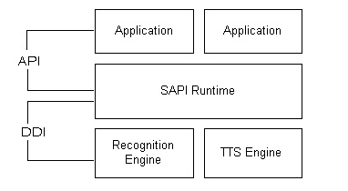

# 微软 Speech API 简述

现在的Windows上语音引擎有很多，但是很多引擎都是在线识别的，且都需要提供账号等才能免费识别。我们需要一个简单，免费的离线识别引擎，于是就想到了微软的语音引擎sapi，这个sapi是微软的经典语音引擎，虽然现在微软在推广它们的Azure新引擎，不过也是在线且不免费的。

微软的语音引擎sapi是基于C++语言的COM标准的语音接口模块，它广泛用于之前的Windows系统的语音识别和其他的一些应用中。
因为微软现在在使用Azure语音引擎，sapi它们就不再用了，所以现在无法在微软官网中下载，不过sapi已经作为Windows系统的api接口与其他接口一起提供了，所以只要安装了C++编译器，就会带sapi方面的源文件来供大家使用，和C++标准库一样，我们在编程时直接`#include <sapi.h>`就能使用sapi语音引擎。

sapi语音引擎最后一个版本为5.4版本，微软虽然不再提供下载渠道，但是之前的教程还是存在，所以我们可以在[微软sapi 5.4教程](https://docs.microsoft.com/zh-cn/previous-versions/windows/desktop/ee125077(v=vs.85))中学习sapi的使用。

接下来，我就基于该教程在Windows10系统上来介绍sapi 5.4的使用。

## 1.1 SAPI简介

sapi是微软提供的语音模块，它是基于COM标准的模块，也就是COM组件，COM组件就是符合微软推行的COM标准的支持多个接口的组件。
符合COM的模块继承了IUnknown接口中的几种虚函数，比如查询函数和引用计数函数。所以在使用这些模块的时候需要遵循COM组件的操作流程，比如要自己计数等。
不过COM模块都可以使用于一个管理COM接口智能指针类`CComPtr`，它在头文件`sphelper.h`中。
通过使用智能来使用接口，就可以避免自己手动来计数等操作，有关智能指针类`CComPtr`的用法，可以参考[微软`CComPtr`教程](https://docs.microsoft.com/zh-cn/cpp/atl/reference/ccomptr-class?view=msvc-160)。

sapi接口是在应用层面与语音引擎层面的桥梁，因为它实现了控制与管理不同语音引擎操作等底层细节的功能，从而方便我们操作和管理语音引擎。



sapi作为一个语音模块，它提供基本两大语音模块功能：
* 文字转语音(text to speech(TTS))
* 语音识别(speech recognition(SR))

基于这两大功能，sapi提供了多个接口和类来实现功能，其中根据功能，它们可以分为以下几类：
* 应用级接口：
  该类接口提供可以直接在我们自己的程序中直接使用的语音模块，我们不需要自己修改语音模型方面就能够直接使用。
* 引擎级接口：
  该类接口提供了一些底层的设备驱动接口(DDI)，可以让我们修改sapi中的语音模型或者使用自己的语音模型来达到引擎自定义的效果。
* 相关的类：
  以上的一些接口使用了某些结构类和枚举类型来实现一些功能，还定义了一些异常变量来提供各种错误信息。
  微软还提供了一些辅助类来让我们方便使用和管理接口。
* 相关杂项：
  微软还提供了这些接口相关信息，如CLSID，类别ID等，还提供了一些简单的语音UI，以供查询使用。

接下来的内容，我会先简单介绍下用sapi实现TTS和SR功能的流程，然后在详细介绍这些功能所需要用到的一些接口。

## 1.2 实现TTS的流程

实现TTS的核心接口就是`ISpVoice`接口，该接口既用于控制TTS引擎的各方面，也用于SAPI中的事件机制，所以对于TTS来说，只使用`ISpVoice`接口就能完成操作。

该接口支持文本合成(也就是文本朗读，可以是字符串变量或者文本，支持XML文本)，也支持输出音频数据流到指定的输出设备(也就是音频朗读)。

我们来可以设置其中的各种属性，如音量，语速等。
`ISpVoice`接口还继承了sapi中的消息接口`ISpEventSource`，该接口是记录引擎各种事件的接口，所以我们可以根据不同的事件来进行操作。

对于常规的TTS操作，一般是通过创建`ISpVoice`接口的对象，并对该对象设置各种属性，包括输出源(语音文本或音频数据流)，就可以完成TTS操作。
因为是通过创建接口的对象(实例)来完成TTS的，所以同一个程序可以有多个实例来进行不同场景或方向的TTS，每个都是独立于其他的实例。

实现TTS的流程大致为以下几个步骤：
1. 创建`ISpVoice`的实例。
2. 设置实例的各种属性，比如输出设备、语速、音量和语音文本等，此时就算完成了TTS操作的实现。
3. 自己根据使用的场景，可以添加其他功能，也可以引入消息机制来对各种输入进行监听，实现各种语音输出，其中消息机制可以使用Win32 api中的消息循环，也可以用sapi中提供的消息机制或者事件机制来操作。

以下是一个简单的TTS操作示例，实现了简单的文本转语音：
```c++
#include <sapi.h>
#include <sphelper.h>
#include <stdio.h>
#include <string.h>
#include <locale.h>

// 输出执行记录
void trace(const char* strs) { printf("%s\n", strs); }
// 回调函数声明，用于消息循环，与Win32 api中的窗口过程函数类似
void __stdcall callback_func(WPARAM wParam, LPARAM lParam);

// TTS类，用于创建ISpVoice实例等操作
struct Tts
{
    // ISpVoice的智能指针cpIspv
    CComPtr<ISpVoice>cpIspv;
    // 判断实例是否创建成功
    bool create_success;
    // 记录创建实例的数量
    static unsigned create_count;
    // 实例名称
    char obj_name[88];
    // 构造函数，用于创建ISpVoice的实例和设置各种参数
    Tts(const wchar_t* vTkn, long rate, USHORT volume, SPVPRIORITY priority = SPVPRI_NORMAL) : create_success(true), obj_name{}
    {
        // 创建实例名称
        char temp_str[10];
        strcat(strcpy(obj_name, "tts_obj"), ultoa(++create_count, temp_str, 10));
        // 创建ISpVoice实例，cpIspv指向该实例
        HRESULT spv_hr = CoCreateInstance(CLSID_SpVoice, NULL, CLSCTX_ALL, IID_ISpVoice, (void**)&cpIspv);
        // 判断实例是否创建成功
        if (FAILED(spv_hr))
        {
            trace("TTS:\tcreate SpVoice failed!");
            create_success = false;
            return;
        }
        // 设置实例输出源
        cpIspv->SetOutput(NULL, TRUE);
        // 获取ISpVoice相关的声音资源
        CComPtr<ISpObjectToken> cpSpvToken;
        HRESULT spvTkn_hr = SpFindBestToken(SPCAT_VOICES, vTkn, L"Vendor=VoiceVendor1", &cpSpvToken);
        if (FAILED(spvTkn_hr))
        {
            trace("TTS:\tget Voice Token failed!");
            create_success = false;
            return;
        }
        // 设置实例的声音
        cpIspv->SetVoice(cpSpvToken);
        // 设置实例语速
        cpIspv->SetRate(rate);
        // 设置实例音量
        cpIspv->SetVolume(volume);
        // 设置实例输出语音的优先级
        cpIspv->SetPriority(priority);
        // 设置实例相关联的回调函数
        cpIspv->SetNotifyCallbackFunction(callback_func, 0, 0);
        // 设置实例所需要关注的消息
        ULONGLONG ullMyevnt = SPFEI(SPEI_START_INPUT_STREAM) | SPFEI(SPEI_END_INPUT_STREAM) | SPFEI(SPEI_WORD_BOUNDARY);
        cpIspv->SetInterest(ullMyevnt, ullMyevnt);
    }
    // 设置实例语音文本及其输出方式
    HRESULT speaking(const wchar_t* text, DWORD dwflags = SPF_ASYNC)
    {
        cpIspv->Speak(L"the speaking will start right now.", dwflags, NULL);
        printf("%s:\tWord1: the speaking will start right now.\n", obj_name);
        cpIspv->Speak(text, dwflags, NULL);
        printf("%s:\tWord2: %ls\n", obj_name, text);
        cpIspv->Speak(L"the speaking has finished, thanks!", dwflags, NULL);
        printf("%s:\tWord3: the speaking has finished, thanks!\n\n", obj_name);
        return S_OK;
    }
    // 处理实例的各种事件
    void get_status()
    {
        // 使实例朗读完其所有的语音
        cpIspv->WaitUntilDone(INFINITE);
        /* 根据实例的事件处理各种信息 */
        // 事件类，保存某个事件的各种信息 */
        SPEVENT spvEvnt;
        // 事件资源消息类，保存实例事件列表的长度等信息
        SPEVENTSOURCEINFO spvEvntInf;
        // 循环获取实例的每个事件
        while (SUCCEEDED(cpIspv->GetEvents(1, &spvEvnt, NULL)))
        {
            // 获取实例当前的事件资源消息
            cpIspv->GetInfo(&spvEvntInf);
            // 根据事件的类型进行不同的操作
            switch (spvEvnt.eEventId)
            {
                // 语音合成开始事件
            case SPEI_START_INPUT_STREAM:
                printf("status record:\t%s: the tts has begun synthesizing\n", obj_name);
                break;
                // 语音合成结束事件
            case SPEI_END_INPUT_STREAM:
                printf("status record:\t%s: the tts has finished synthesizing\n\n\n\n\n", obj_name);
                break;
                // 单词合成事件
            case SPEI_WORD_BOUNDARY:
                printf("\nstatus record:\t%s: the word start being synthesize\n", obj_name);
                // 输出该单词的长度
                printf("status record:\t%s: the length of this word is %u\n", obj_name, spvEvnt.wParam);
                // 输出该单词在整个语音文本中的位置
                printf("status record:\t%s: the position of this word in sentence is %d\n\n", obj_name, spvEvnt.lParam);
                break;
            }
            // 判断实例的事件列表是否为空，为空就退出循环
            if (spvEvntInf.ulCount == 0)
            {
                printf("status record:\t%s: this tts operation has finished\n\n\n\n\n\n\n", obj_name);
                break;
            }
        }
    }
    ~Tts() {}
};
unsigned Tts::create_count = 0;

// 回调函数
void __stdcall callback_func(WPARAM wParam, LPARAM lParam)
{
    static unsigned count = 0;
    // 输出传递给该函数的实参
    printf("\nrecord:\tthe data is %u, %d\n", wParam, lParam);
    // 输出该函数被调用的次数
    printf("\nrecord:\tthe func has been called %u times\n\n", ++count);
}

int main()
{
    // 设置中文环境，使宽字符汉字在printf中可以正常显示。
    setlocale(LC_ALL, "zh-CN");
    // 初始化COM库
    if (FAILED(::CoInitialize(NULL)))
    {
        trace("TTS:\tInitiate failed!");
        return -1;
    }
    // 创建3个不同语音和优先级的ISpVoice实例
    Tts tts_obj1(L"Gender=Female;Language=804", 1, 100);
    Tts tts_obj2(L"Gender=Male;Language=409", 1, 100);
    Tts tts_obj3(L"Gender=Female;Language=409", 1, 100, SPVPRI_OVER);
    // 设置这3个ISpVoice实例的语音文本及输出方式
    if (!tts_obj1.create_success || FAILED(tts_obj1.speaking(L"世界你好！", SPF_DEFAULT)))
        return -1;
    if (!tts_obj2.create_success || FAILED(tts_obj2.speaking(L"hello world！")))
        return -1;
    if (!tts_obj3.create_success || FAILED(tts_obj3.speaking(L"hello world！")))
        return -1;
    // 处理3个实例的各种事件
    tts_obj1.get_status();
    tts_obj2.get_status();
    tts_obj3.get_status();
    // 消息循环，用于调用回调函数callback_func
    MSG msg;
    while (GetMessage(&msg, NULL, 0, 0))
    {
        TranslateMessage(&msg);
        DispatchMessage(&msg);
    }
    // 卸载COM库
    ::CoUninitialize();
    return 0;
}
```

## 1.3 实现SR的流程

和TTS类似，实现SR的核心接口为`ISpRecoContext`接口，但与TTS中的`ISpVoice`接口不同，`ISpRecoContext`接口虽然为核心接口，但是它并不能完成所有的SR操作。
对于SR，我们需要语音识别器、语法设置器和上下文。而`ISpRecoContext`接口只是上下文，我们还需要创建语音识别器接口`ISpRecognizer`和语法设置器接口`ISpRecoGrammar`并将它们关联起来。

在这三个接口中，最基础的是语音识别器接口`ISpRecognizer`，该接口用于控制SR引擎的各个方面，一个识别器实例可以关联多个上下文(不过同一时间只能关联一个)。
根据SR引擎的类型，可以创建两种不同类型的识别器，每种识别器代表一种类型的SR引擎：
* 共享识别器
  共享识别器是可以与其他程序共享的识别器类型，该识别器使用共享型SR引擎。
  共享型SR引擎被创建在另一个进程中，一个操作系统同一个时间只能有一个共享型SR引擎在运行，所有使用共享型SR引擎的程序都会连接到同一个共享识别器。
* 进程内识别器
  进程内识别器是创建该识别器的程序才能使用的识别器类型，该识别器使用进程内SR引擎。
  进程内SR引擎被创建在该进程中，其他程序不能使用该SR引擎。

上下文接口`ISpRecoContext`作为SR中的核心接口，承担着连接其他接口(可以与识别器和语法设置器连接)和接收事件的作用。
上下文和识别器一样，有类型的区别，且其类型和识别器的一样。这表示上下文能够关联的识别器类型，不同类型的上下文和识别器之间不能关联。
上下文继承了`ISpEventSource`接口，还可以关联不同的语法设置器，所以我们可以创建对不同事件该兴趣的，关联不同语法设置器的上下文实例，从而用于程序的不同使用场景。

语法设置器接口`ISpRecoGrammar`是SR中的另一个必要的接口，语法设置器用于设置SR引擎可以识别的单词和词组(可用XML文本来设置)。
一个语法设置器实例也可以关联多个上下文(不过同一时间只能关联一个)，由此可以设置多个不同的语法设置器来满足程序的不同场景需求。
所有的语法设置器实例可以同时支持两种不同的语法模式：
* 命令与控制式语法(C&C)
* 听说式语法(dictation)

当实例使用其中一种语法但识别语音失败时，可以自动切换到另一种语法继续识别。

常规的SR操作流程大致为以下几个步骤：
1. 创建上下文、识别器和语法设置器实例，然后将它们关联起来(比如先创建这3个接口的指针，然后创建一个上下文实例(此时会自动创建与该实例类型相同的识别器实例并关联)，再用上下文实例中的函数来获取该上下文的识别器实例和创建语法设置器实例，此时就完成了实例的创建并关联)。
2. 设置识别器中的一些属性，比如SR引擎所用的输入流等；设置上下文中的一些属性，尤其是要设置感兴趣事件，其中`SPEI_RECOGNITION`事件不能缺少，这样我们才能在语音识别成功后对其进行某些操作，比如获取识别的文本等。
3. 设置语法设置器中的语法，创建SR引擎能够识别的单词句子，其中最方便的是用XML文本进行设置。
4. 编写事件处理代码，使其可以对感兴趣的事件进行操作。
   事件处理代码要能够持续监视事件队列，从而识别器能够有时间进行语音识别。
   可以使用循环结构或者使用sapi的消息通知机制来实现持续监视功能。
5. 最后激活刚才设置的语法，并使识别器处于活动状态，这样就完成了SR操作的实现。

以下是一个简单的SR操作示例，实现了语音转文本：
```c++
#include <sapi.h>
#include <sphelper.h>
#include <stdio.h>
#include <locale.h>

void trace(const char* strs) { printf("%s\n", strs); }

void __stdcall sp_callback(WPARAM wParam, LPARAM lParam);

struct My_sp
{
    CComPtr<ISpVoice>cpIspv;
    CComPtr<ISpRecognizer>cpIsprEng;
    CComPtr<ISpRecoContext>cpIsprCntxt;
    CComPtr<ISpRecoGrammar>cpIsprGramr;
    My_sp() { trace("the speech project will start"); }
    virtual ~My_sp() { trace("the speech project finished"); }
    void text_to_speech(wchar_t strs, long rate, USHORT volume)
    {
        if (FAILED(::CoInitialize(NULL)))
        {
            trace("TTS:\tInitiate failed!");
            return;
        }
        HRESULT spv_hr = CoCreateInstance(CLSID_SpVoice, NULL, CLSCTX_ALL, IID_ISpVoice, (void**)&cpIspv);
        if (FAILED(spv_hr))
        {
            trace("TTS:\tcreate SpVoice failed!");
            return;
        }
        cpIspv->SetRate(1);
        cpIspv->SetVolume(100);
        cpIspv->Speak(L"你好你好", 0, NULL);
        ::CoUninitialize();
    }
    
    void speech_recognition()
    {
        if (FAILED(::CoInitialize(NULL)))
        {
            trace("SR:\tInitiate failed!");
            return;
        }
        if (FAILED(cpIsprCntxt.CoCreateInstance(CLSID_SpSharedRecoContext)))
        {
            trace("SR:\tcreate SharedRecoContext failed!");
            return;
        }
        if (FAILED(cpIsprCntxt->GetRecognizer(&cpIsprEng)))
        {
            trace("SR:\tcreate SharedRecognizer failed!");
            return;
        }
        ULONGLONG ullEvents = SPFEI(SPEI_SOUND_START) | SPFEI(SPEI_SOUND_END) | SPFEI(SPEI_RECOGNITION);
        cpIsprCntxt->SetInterest(ullEvents, ullEvents);
        cpIsprCntxt->CreateGrammar(0, &cpIsprGramr);
        //if (FAILED(cpIsprCntxt->SetNotifyCallbackFunction(sp_callback, 0, 0)))
        //{
        //    trace("SR:\tset CallbackFunction failed!");
        //    return;
        //}
        HRESULT                       hr = S_OK;
        SPSTATEHANDLE                 hStateTravel = NULL;
        hr = cpIsprGramr->GetRule(L"Test", 0, SPRAF_TopLevel | SPRAF_Active, TRUE, &hStateTravel);
        if (SUCCEEDED(hr))
        {
            hr = cpIsprGramr->AddWordTransition(hStateTravel, NULL, L"我要", NULL, SPWT_LEXICAL, 1, NULL);
        }
        if (SUCCEEDED(hr))
        {
            hr = cpIsprGramr->AddWordTransition(hStateTravel, NULL, L"吃鸡", NULL, SPWT_LEXICAL, 1, NULL);
        }
        if (SUCCEEDED(hr))
        {
            hr = cpIsprGramr->AddWordTransition(hStateTravel, NULL, L"手机", NULL, SPWT_LEXICAL, 1, NULL);
        }
        if (SUCCEEDED(hr))
        {
            hr = cpIsprGramr->Commit(0);
        }
        // Declare local identifiers:
        //WCHAR wszXMLFile[20] = L"";//加载语法
        //MultiByteToWideChar(CP_ACP, 0, (LPCSTR)"CmdCtrl.xml", -1, wszXMLFile, 256);//ANSI转UNINCODE
        //cpIsprGramr->LoadCmdFromFile(wszXMLFile, SPLO_DYNAMIC);
        cpIsprGramr->SetRuleState(L"Test", NULL, SPRS_ACTIVE);
        cpIsprEng->SetRecoState(SPRST_ACTIVE);
        //MSG msg;
        //while (GetMessage(&msg, NULL, 0, 0))
        //{
        //    TranslateMessage(&msg);
        //    DispatchMessage(&msg);
        //}
        CSpEvent cspEvt;
        SPEVENTSOURCEINFO spEvntInfo;
        while (SUCCEEDED(cspEvt.GetFrom(cpIsprCntxt)))
        {
            //cpIsprCntxt->GetInfo(&spEvntInfo);
            //printf("the event amount is %d\n", (int)spEvntInfo.ulCount);
            switch (cspEvt.eEventId)
            {
            //case SPEI_SOUND_START:
            //{
            //    trace("SR:\tstarted recognition!");
            //    break;
            //}
            //case SPEI_SOUND_END:
            //{
            //    trace("SR:\tFinish recognition!");
            //    break;
            //}
            case SPEI_RECOGNITION:
            {
                wchar_t* pwszText;
                if (SUCCEEDED(cspEvt.RecoResult()->GetText(SP_GETWHOLEPHRASE, SP_GETWHOLEPHRASE, TRUE, &pwszText, NULL)))
                    printf("%ls\n", pwszText);
                break;
            }
            default:
                break;
            }
        }
        ::CoUninitialize();
    }
};

My_sp my_speech;

//void __stdcall sp_callback(WPARAM wParam, LPARAM lParam)
//{
//    static int count = 0;
//    printf("call times:\t%d\n", ++count);
//    SPEVENT Spevt;
//    SPEVENTSOURCEINFO spEvntInfo;
//    if (SUCCEEDED(my_speech.cpIsprCntxt->GetEvents(1, &Spevt, NULL)))
//    {
//        my_speech.cpIsprCntxt->GetInfo(&spEvntInfo);
//        printf("the event amount is %d\n", (int)spEvntInfo.ulCount);
//        switch (Spevt.eEventId)
//        {
//            case SPEI_SOUND_START:
//            {
//                trace("SR:\tstarted recognition!");
//                break;
//            }
//            case SPEI_SOUND_END:
//            {
//                trace("SR:\tFinish recognition!");
//                break;
//            }
//            case SPEI_RECOGNITION:
//            {
//                CComPtr<ISpRecoResult>cpIsprRes = (ISpRecoResult*)Spevt.lParam;
//                SPPHRASE* pSph;
//                wchar_t *pwszText;
//                if (SUCCEEDED(cpIsprRes->GetPhrase(&pSph)))
//                {
//                    cpIsprRes->GetText(SP_GETWHOLEPHRASE, SP_GETWHOLEPHRASE, TRUE, &pwszText, NULL);
//                    printf("%ls\n", pwszText);
//                }
//                break;
//            }
//            default:
//                break;
//        }
//    }
//}

int main()
{
    setlocale(LC_ALL, "zh-CN");
    my_speech.speech_recognition();
    return 0;
}
```

